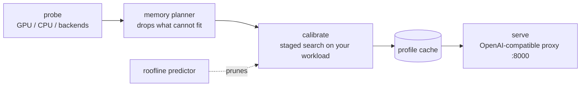

# PolyServe

[](https://github.com/Aagam-Bothara/polyserve/actions/workflows/tests.yml)

**PolyServe measures which serving settings pay off on your GPU and your traffic, then serves the winner.** Give it a model: it probes the machine, benchmarks vLLM and llama.cpp configurations on your workload, tells you what each option costs in answer quality, and serves the pick behind an OpenAI-compatible API.

The claim is deliberately narrow. Against stock settings it wins clearly. Against an expert who already passes the right flags it mostly ties, except where the best settings depend on what the traffic contains. That is where the search earns its keep.

## Results

Qwen2.5 models on rented GPUs, objective `balanced`, PolyServe's default `--quant auto` (no 4-bit weights). Full tables, per-strategy ablations and methods are in [docs/benchmarks.md](docs/benchmarks.md).

| Machine, model | Workload | PolyServe pick | vs stock `vllm serve` | vs stock with `--quantization fp8` |
|---|---|---|---|---|
| A40, 3B | `extract` (copy facts out of news articles) | bf16 + 0.5B draft model | **+66.5%** | stock fp8 fails to start (vLLM 0.29 on Ampere) |
| A40, 3B | `sharegpt` (real chat first turns) | bf16 + fp8 KV cache, batch 512 | +10.3% | fails to start |
| A40, 3B | `code-edit` (add type hints to functions) | bf16 + fp8 KV cache | +5.2% | fails to start |
| L4 24 GB, 7B | `chat` | fp8 weights | stock misses the 50 ms/token target at any load | tie, 195 tok/s |
| L4 24 GB, 7B | `sharegpt` | fp8 weights + fp8 KV cache | +80% | +5.3%, at a higher time to first token |
| CPU container (7.65 cores), 0.5B | `default` | llama.cpp, 1 slot + n-gram speculation | +36.5% over stock `llama-server`* | |

\* Synthetic prompts, which flatter n-gram speculation; treat it as an upper bound.

- **The right precision depends on the card and the latency target.** On the L4, fp8 beat 4-bit because 4-bit's slower prefill broke the first-token target; on the A40, where vLLM 0.29 offers no fp8, 4-bit ran at twice bf16.
- **Quality is measured, not assumed.** On all 1,319 GSM8K problems, paired against bf16: on Qwen2.5-3B fp8 cost 2.4 points and 4-bit 4–5 (all significant); on 7B none cost a measurable amount. So `--quant auto` leaves 4-bit out, and `--quant auto,awq,gptq` puts it back (it doubled throughput on real text).
- **Some strategies only pay together, and some get in each other's way.** On `extract` the fp8 cache helped on its own but slowed the draft model. The search finds that by undoing each change it adopted.
- **Speculative decoding depends on load and content.** n-gram lookup made one user 80% faster on code edits and collapsed from four users up. PolyServe measures at your workload's concurrency.

## Quickstart

```bash
pip install git+https://github.com/Aagam-Bothara/polyserve.git   # not on PyPI yet
pip install "vllm==0.29.0"     # driver 580+; older drivers: "vllm==0.11.0" "transformers>=4.56,<5"
polyserve serve Qwen/Qwen2.5-3B-Instruct --workload chat
curl localhost:8000/v1/chat/completions -H 'content-type: application/json' \
  -d '{"model":"Qwen/Qwen2.5-3B-Instruct","messages":[{"role":"user","content":"hi"}]}'
```

The first launch calibrates, which takes 20–45 minutes, and caches the result per machine, model, objective and workload. Later launches serve at once. `--skip-calibration` serves the first candidate with default settings. For llama.cpp, build `llama-server` with CUDA and put it on `PATH` or in `LLAMA_SERVER`.

With Docker (the image builds on the official vLLM image and has not yet been built in CI):

```bash
docker build -t polyserve .
docker run --gpus all --ipc=host -p 8000:8000 -v ~/.cache/huggingface:/root/.cache/huggingface \
  -v ~/.polyserve:/root/.polyserve polyserve serve Qwen/Qwen2.5-3B-Instruct
```

## Supported hardware

| Hardware | Backends tried | Measured |
|---|---|---|
| NVIDIA, compute capability ≥ 7.5 | vLLM, SGLang, llama.cpp (CUDA) | vLLM 0.11 and 0.29 and llama.cpp on an A40 and an L4, two-GPU layouts on a pair of A40s; SGLang **never benchmarked** |
| NVIDIA, compute capability < 7.5 | llama.cpp (CUDA) | **never benchmarked** |
| x86 CPU | llama.cpp; vLLM-CPU with AVX-512 | llama.cpp in a CPU container; vLLM-CPU **never benchmarked** |

Linux, Python 3.10–3.13.

## How it works



1. **Probe** the GPU, VRAM, CPU cores (within a container's quota) and installed backends.
2. **Plan**: estimate weights + KV cache + workspace for every candidate and drop what will not fit.
3. **Calibrate** on your workload in stages: precision, memory, batch, prefill budget, KV-cache type, prefix caching, speculative decoding, then combinations, including the leader with each adopted change undone. A backend that falls far behind stops being measured.
4. **Cache** the chosen configuration with its full calibration table.
5. **Serve** it as a supervised process behind a proxy on `:8000`; `/polyserve/profile` shows what runs and why.

Every step, workload and option is described in [docs/usage.md](docs/usage.md).

## Main options

| Option | Default | Choices |
|---|---|---|
| `--workload` | `default` | `chat`, `generation`, `rag`, `long-context`, `high-concurrency`, shared-prefix `chat-system` and `rag-shared`, real-text `sharegpt`, `extract` and `code-edit` |
| `--objective` | `balanced` | `throughput`, `latency`, `balanced` (throughput under a time-to-first-token ceiling), `efficiency` |
| `--quant` | `auto` | weight precisions to consider; 4-bit AWQ/GPTQ is opt-in with `auto,awq,gptq` |
| `--kv-quant`, `--prefix-cache`, `--speculative`, `--combine` | `on` | `off` rules a search stage out |
| `--layout` | `single` | `replicas`, `tp` or `auto` across several GPUs |

The full CLI is in [docs/usage.md](docs/usage.md#cli).

## Limits

- Against someone who already picks the right precision and flags, the rest of the search is worth a few percent, except where content decides, as on `extract`.
- Never run on real hardware: SGLang, vLLM-CPU, pre-Turing GPUs, and `--power`, which has only run against a simulated NVML.
- Measured on one model family (Qwen2.5) and three machines, with quality graded on one task.
- Calibration takes tens of minutes per workload.

What is still unmeasured, in order of how much it could change the conclusions: [docs/benchmarks.md](docs/benchmarks.md#not-yet-measured).

## Documentation

- [docs/usage.md](docs/usage.md): how calibration works, workloads, objectives, every search option, the CLI and the backend interface.
- [docs/benchmarks.md](docs/benchmarks.md): every measured result, with methods, ablations, quality, and the planner's and predictor's accuracy.
- [docs/writeup.md](docs/writeup.md): the design of the memory planner, the staged search and the predictor.
- [benchmarks/strategies/SUMMARY.md](benchmarks/strategies/SUMMARY.md): every table, regenerated from the raw JSON.

## Non-goals and roadmap

PolyServe sits above vLLM, SGLang and llama.cpp and launches them; it is not a replacement, a compiler or a kernel library, and it supports only the hardware listed above. Planned: AMD ROCm and Apple Silicon backends, Windows, and re-tuning under live traffic instead of a one-time calibration.

## Development

```bash
pip install -e ".[dev]"
pytest                                  # no GPU or backend needed
ruff check polyserve tests benchmarks
```

See [CONTRIBUTING.md](CONTRIBUTING.md).

## License

MIT
