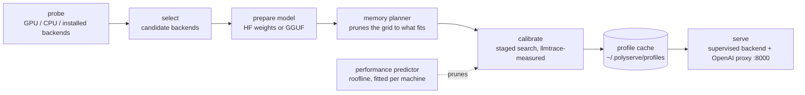

# PolyServe

**PolyServe helps you run LLMs on your own hardware without tuning an inference backend by hand.** Give it a model, and it checks your machine, benchmarks the available options, and serves the chosen configuration through an OpenAI-compatible API.

```bash
pip install polyserve
polyserve serve meta-llama/Llama-3.2-3B-Instruct            # --objective balanced
curl localhost:8000/v1/chat/completions -d '{"model":"meta-llama/Llama-3.2-3B-Instruct","messages":[{"role":"user","content":"hi"}]}'
```

First launch: discover hardware → prepare model → calibrate once → serve.
Later launches: load the cached profile → serve.

PolyServe works with vLLM, SGLang and llama.cpp. It handles the setup questions that usually take trial and error: which backend to use, which quantization fits, and how to set memory and batch sizes for your workload. It makes those choices by running benchmarks on your machine.

---

## Supported hardware (v1)

| Hardware | Backends tried |
|---|---|
| NVIDIA, compute capability ≥ 7.5 (Turing and newer) | vLLM, SGLang, llama.cpp (CUDA) |
| NVIDIA, compute capability < 7.5 (Pascal, Volta) | llama.cpp (CUDA) |
| x86 CPU | llama.cpp; vLLM-CPU if AVX-512 is present |

PolyServe runs on Linux with Python 3.10–3.13. The table above lists the backend candidates for each type of hardware; the benchmarks below show what has been measured so far.

Install the backends you want to try. PolyServe starts each one as a separate process and supplies the settings it has tuned:

```bash
pip install polyserve[nvml]          # + NVML telemetry (power, utilisation) for calibration
pip install "vllm==0.11.0" "transformers>=4.56,<5"   # vLLM 0.11 breaks on transformers 5.x
pip install sglang                   # optional
export LLAMA_SERVER=/path/to/llama-server   # build llama.cpp with -DGGML_CUDA=ON; optional if on PATH
```

---

## How it works



1. **Check your hardware.** PolyServe detects your GPU, its compute capability and VRAM, CPU cores and AVX2/AVX-512 support, RAM, and which backends can run. Use `polyserve probe` to inspect the resulting `HardwareDescriptor`.

2. **Choose candidate backends.** The hardware rules above determine which backends to try. If several are available, calibration decides which one to use.

3. **Prepare the model.** vLLM and SGLang use Hugging Face weights directly. For llama.cpp, PolyServe finds a pre-quantised GGUF on the Hub (Q4_K_M, Q5_K_M, Q6_K or Q8_0), or converts and quantises FP16 weights locally. It only prepares the quantizations that pass memory planning.

4. **Check what fits in memory.** Before launching a backend, the planner estimates its memory needs:

   `estimated = weights + kv_cache(ctx, batch, dtype) + runtime_workspace + safety_margin`

   It keeps a configuration only if `estimated ≤ 0.95 × available`. On a 24 GB card, this reduced 54 vLLM candidates to 48 for a 3B model at 4k context, and to 18 at 32k. None of the admitted configurations ran out of memory in that run. Use `polyserve plan <model>` to see what fits before launching anything.

   Each trial records the estimate alongside measured peak memory from NVML and the backend's own weight, KV cache and workspace figures. `polyserve memory-report` shows the errors by backend. Add `--apply` to replace the initial workspace constant and 5% margin with values fitted to your machine.

5. **Benchmark the candidates.** Calibration starts with a short run per quantization and keeps the top two. It then selects the largest safe memory configuration and tries different batch sizes and concurrency levels.

   A performance predictor helps narrow the search. Its roofline model accounts for weight and KV bandwidth, decode and prefill compute, and queueing beyond the available slots. `polyserve fit` fits three efficiency parameters per backend using your machine's trials. The predictor skips quantizations expected to perform far below the best and tests promising batch settings first. `polyserve predict` shows the predictions without launching a backend; `fit` reports leave-one-out error and rank correlation so you can check their accuracy.

   Each trial replays a fixed synthetic workload. The default uses 16 prompts, a 256-token prefill and a 128-token decode at concurrency 1/4/8, taking roughly 10 seconds. [llmtrace](https://github.com/Aagam-Bothara/llmtrace) measures tokens per second, time to first token (TTFT), time per output token (TPOT), peak memory, GPU utilisation and power.

6. **Save the results.** The chosen configuration, full launch arguments, calibration table and versions are saved in `~/.polyserve/profiles/<hardware_hash>/<model>/<objective>[-<workload>].json`. A hardware or backend version change invalidates the profile. You can also force a fresh run with `polyserve recalibrate`.

7. **Start serving.** PolyServe runs the chosen backend as a supervised process, with health checks and automatic restarts. A proxy on `:8000` exposes `/v1/chat/completions`, `/v1/completions` and `/v1/models`, with streaming passthrough. Visit `/polyserve/profile` to see the active configuration and calibration table.

### Workloads

An interactive chat and a long document query need different settings. Use `--workload` to choose the synthetic traffic used during calibration. Each preset has a time-to-first-token (TTFT) limit for the `balanced` objective. PolyServe caches profiles separately for each workload, so `serve --workload rag` and `serve --workload chat` each get their own calibration.

| `--workload` | prefill | decode | concurrency | TTFT ceiling | shaped like |
|---|---|---|---|---|---|
| `default` | 256 | 128 | 1 / 4 / 8 | 500 ms | the spec's calibration workload |
| `chat` | 512 | 128 | 1 / 4 / 8 | 500 ms | assistant turns |
| `long-context` | 8192 | 256 | 1 / 2 / 4 | 2000 ms | document Q&A, summarisation |
| `generation` | 128 | 1024 | 1 / 4 / 8 | 500 ms | code / story generation |
| `high-concurrency` | 256 | 64 | 32 / 64 / 128 | 1000 ms | many short requests |
| `rag` | 6144 | 64 | 1 / 4 / 8 | 1500 ms | retrieval-augmented answers |

Prompt lengths are exact when the model's tokenizer is available (prompts are fitted to the target token count), and output tokens are counted from the server's `usage` or the tokenizer, never from stream chunks. The planner drops any config whose context cannot hold prefill + decode.

```bash
polyserve serve meta-llama/Llama-3.2-3B-Instruct --workload chat
polyserve serve meta-llama/Llama-3.2-3B-Instruct --workload rag
polyserve serve meta-llama/Llama-3.2-3B-Instruct --workload long-context
```

### Objectives

Choose what you want to optimise. PolyServe ranks configurations using the rules below, rather than combining the measurements into a weighted score.

| `--objective` | Rule |
|---|---|
| `throughput` | Highest tokens per second |
| `latency` | Lowest TTFT while meeting the minimum tokens per second |
| `balanced` (default) | Highest tokens per second within the workload's TTFT limit; override it with `--ttft-ceiling` |
| `efficiency` | Lowest joules per token while meeting the minimum tokens per second |

The minimum throughput defaults to 50% of the best observed tokens per second. Set `--tok-s-floor` to use an absolute value instead. If no configuration meets the constraint, PolyServe chooses the one that comes closest and records that in the profile.

---

## CLI

```
polyserve serve <model> [--objective X] [--workload W] [--port N] [--backend NAME] [--skip-calibration]
polyserve probe                 # print HardwareDescriptor
polyserve workloads             # list workload presets
polyserve plan <model>          # print feasible configs without running them
polyserve bench <model>         # run calibration and print the table, don't serve
polyserve recalibrate <model>   # force a rerun and overwrite the cached profile
polyserve profiles              # list cached profiles
polyserve compare <model>       # PolyServe's pick vs stock defaults vs Ollama, one workload -> results JSON
polyserve report                # aggregate results: median gain over the best SLO-meeting default + plot
polyserve memory-report [--apply]  # planner prediction vs measured peak memory; --apply fits workspace + margin
polyserve predict <model>       # predicted tok/s / TTFT for every feasible config, no launches
polyserve fit [--apply]         # fit the predictor from cached calibrations; leave-one-out accuracy
```

To start serving without waiting for benchmarks, use `--skip-calibration`. This launches the first candidate backend with default settings and does not cache a profile.

---

## Benchmarks

All rows measured on one RTX 3090 (24 GB, cc 8.6) with vLLM 0.11.0, llama.cpp CUDA and Ollama 0.34 installed, driven by `polyserve compare`: PolyServe's calibrated pick and every stock default run against the same workload, minutes apart, on the same card. Telemetry via llmtrace (NVML at 100 ms). Raw results are in [benchmarks/results/](benchmarks/results/); `polyserve report` regenerates [benchmarks/RESULTS.md](benchmarks/RESULTS.md) and the throughput-vs-TTFT plot.

### Qwen2.5-3B-Instruct, `--objective balanced`

> Across 6 GPU/model/workload combinations, PolyServe improves throughput by a median of **+51%** (range +7% to +67%) over the best stock/default configuration that satisfies the requested latency SLO, winning 6 of 6.

| workload | PolyServe pick | tok/s | best default meeting SLO | tok/s | gain | TTFT Δ | J/token gain | calibration |
|---|---|---|---|---|---|---|---|---|
| `chat` | vLLM fp8, ctx 8192, batch 64 | **1091** | vLLM defaults | 653 | **+67%** | −3 ms | +42% | 399 s / 10 trials |
| `generation` | vLLM fp8, ctx 8192, batch 16 | **1111** | vLLM defaults | 683 | **+63%** | −7 ms | +38% | 1937 s / 10 trials |
| `default` | vLLM fp8, ctx 8192, batch 64 | **1097** | vLLM defaults | 687 | **+60%** | −8 ms | +38% | 480 s / 10 trials |
| `long-context` | vLLM fp8, ctx 32768, batch 16 | **436** | vLLM defaults | 305 | **+43%** | −1 ms | +32% | 397 s / 8 trials |
| `rag` | vLLM fp8, ctx 16384, batch 64 | **705** | vLLM defaults | 504 | **+40%** | −23 ms | +30% | 370 s / 8 trials |
| `high-concurrency` | vLLM fp8, ctx 8192, batch 64 | **3628** | vLLM defaults | 3404 | **+7%** | −126 ms | +6% | 730 s / 10 trials |

In every row PolyServe improved throughput and reduced time to first token, so none of the gain is bought by spending latency. Calibrating all six workloads cost 71 minutes on this card, paid once and cached.

**What made the difference?** Most of the gain came from choosing fp8 over vLLM's default bf16 on Ampere, and matching batch and context sizes to the workload instead of using the model's 32k maximum. The benefit was smaller at high concurrency: with 128 concurrent clients, stock vLLM already kept the card busy. Throughput improved by 7%, while time to first token fell from 276 ms to 142 ms. Under the same load, llama.cpp and Ollama missed the latency target, with first-token waits of 9.6 s and 17 s respectively, because their defaults served one request at a time.

### Memory planner accuracy

Each trial compares the planner's memory estimate with actual allocations reported by NVML and the backend's startup log. Run `polyserve memory-report` to see the comparison, or add `--apply` to fit the planner's constants to your machine.

| backend | scored on | trials | mean abs error | bias | worst under-prediction | OOMs |
|---|---|---|---|---|---|---|
| vLLM | weights + workspace | 42 | **6.9%** | +3.1% | −12.9% | 0 |
| llama.cpp (CUDA) | peak device memory | 32 | **16.6%** | +16.6% | 0.0% | 0 |

Across 66 measured trials the planner predicts its target within **11.6%** on average, worst under-prediction −12.9%, and **zero out-of-memory failures among the configurations it admitted**. That last number is the one the planner is judged on: an admitted config that then OOMs is a planner failure regardless of average error.

The two backends are scored on different quantities on purpose. vLLM and SGLang size their KV pool to fill `gpu_memory_utilization × VRAM`, so their peak memory is a policy choice, not a requirement; scoring against it compares two different things. In this run vLLM's KV pool was **7.7× larger** than the planner budgeted, which is why the conservative `PAGED_KV_FRACTION` never rejected a workable config. llama.cpp allocates exactly what it is asked for, so it is scored on peak memory; its error is entirely over-prediction, traced to a hand-set 768 MB workspace constant against the 253 MB `polyserve memory-report --apply` fitted from these trials.

### Performance predictor

The predictor uses a roofline model with three parameters per backend. `polyserve fit` learns them from trials on the same machine. Accuracy is checked by leaving one trial out at a time and predicting its result.

| backend | observations | error, fitted | error, priors only | rank correlation (Spearman ρ) |
|---|---|---|---|---|
| vLLM | 90 | **22.1%** | 35.1% | **0.90** |
| llama.cpp (CUDA) | 78 | **23.4%** | 54.5% | **0.83** |

Fitting reduces the error by a third for vLLM and by more than half for llama.cpp. For narrowing the search, getting the ranking right matters more than predicting exact throughput. A rank correlation near 0.9 helps the predictor identify quantizations that are unlikely to win, saving a benchmark run.

The predictor still has limits. The fitted bandwidth and compute efficiencies reach their cap of 1.0, suggesting that the roofline model built on vendor peak numbers underestimates what these engines achieve. TTFT predictions are also much less accurate than throughput predictions: scheduling and queueing have a large effect, and the model only approximates them.

### Not yet measured

These runs did not include an A100, A30, GTX 1080, a CPU-only setup, or a second model size. Those measurements are still needed. The matrix in [benchmarks/README.md](benchmarks/README.md) tracks the planned runs; its cells are placeholders until results are available.

## Backend interface

To add support for new hardware, implement a backend class with the following interface. The core runtime stays the same:

```python
class Backend(Protocol):
    name: str
    def available(self, hw) -> bool
    def supports(self, hw, model) -> bool
    def prepare(self, model, hw) -> PreparedModel
    def materialize(self, model, quants) -> PreparedModel      # download / convert only what survived planning
    def memory_model(self, hw) -> MemoryModel                  # workspace constant + KV-token rule
    def estimate_memory(self, cfg, model, hw) -> int
    def candidate_configs(self, hw, model) -> list[Config]
    def launch(self, cfg, model, port) -> Process
    def workload_hooks(self, hw, model) -> LlmtraceHooks
```

v1 implementations: `VllmBackend`, `SglangBackend`, `LlamaCppCudaBackend`, `LlamaCppCpuBackend`, `VllmCpuBackend` in [polyserve/backends/](polyserve/backends/).

---

## Roadmap (not in v1)

- AMD / ROCm (vLLM-ROCm, llama.cpp HIP) — new `Backend` classes.
- Apple Silicon — MLX and llama.cpp Metal.
- Windows.
- Live re-tuning under real traffic instead of a one-time synthetic calibration.
- Custom kernels. PolyServe will keep sitting above the engines, not inside them.

## Non-goals

- **Not a replacement for vLLM / SGLang / llama.cpp.** It sits above them and launches them.
- **Not a compiler.** It is a benchmark-driven configuration planner.
- **Does not promise every machine.** The supported matrix above is explicit; anything else is a plugin.

## Development

```bash
pip install -e .[dev]
pytest            # all tests run without a GPU or any backend installed
```

For more detail on the memory planner, staged search and energy objective, see the [technical writeup](docs/writeup.md).

## License

MIT
