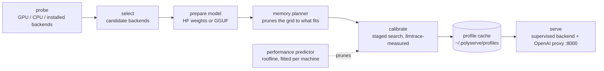

# PolyServe

**PolyServe helps you run LLMs on your own hardware without tuning an inference backend by hand.** Give it a model, and it checks your machine, benchmarks the available options, and serves the chosen configuration through an OpenAI-compatible API.

```bash
pip install git+https://github.com/Aagam-Bothara/polyserve.git   # not yet on PyPI
polyserve serve meta-llama/Llama-3.2-3B-Instruct            # --objective balanced
curl localhost:8000/v1/chat/completions -d '{"model":"meta-llama/Llama-3.2-3B-Instruct","messages":[{"role":"user","content":"hi"}]}'
```

First launch: discover hardware → prepare model → calibrate once → serve.
Later launches: load the cached profile → serve.

PolyServe works with vLLM, SGLang and llama.cpp. It handles the setup questions that usually take trial and error: which backend to use, which quantization fits, and how to set memory and batch sizes for your workload. It makes those choices by running benchmarks on your machine.

---

## Supported hardware (v1)

| Hardware | Backends tried | Status |
|---|---|---|
| NVIDIA, compute capability ≥ 7.5 (Turing and newer) | vLLM, SGLang, llama.cpp (CUDA) | vLLM (0.11 and 0.29) and llama.cpp **benchmarked** on an A40 (Ampere) and an L4 (Ada), multi-GPU layouts on a pair of A40s; SGLang implemented, **never benchmarked** |
| NVIDIA, compute capability < 7.5 (Pascal, Volta) | llama.cpp (CUDA) | implemented, **never benchmarked** |
| x86 CPU | llama.cpp; vLLM-CPU if AVX-512 is present | llama.cpp **benchmarked** CPU-only in a container on a Xeon Gold 6342 (7.65-CPU quota); vLLM-CPU **never benchmarked** |

PolyServe runs on Linux with Python 3.10–3.13. The table above lists the backend candidates for each type of hardware; the benchmarks below show what has been measured so far.

Install the backends you want to try. PolyServe starts each one as a separate process and supplies the settings it has tuned:

```bash
pip install "polyserve[nvml] @ git+https://github.com/Aagam-Bothara/polyserve.git"   # + NVML telemetry
pip install "vllm==0.29.0"            # needs NVIDIA driver 580+; on older drivers: "vllm==0.11.0" "transformers>=4.56,<5"
pip install sglang                   # optional
export LLAMA_SERVER=/path/to/llama-server   # build llama.cpp with -DGGML_CUDA=ON; optional if on PATH
```

---

## How it works



1. **Check your hardware.** PolyServe detects your GPU, its compute capability and VRAM, CPU cores and AVX2/AVX-512 support, RAM, and which backends can run. Use `polyserve probe` to inspect the resulting `HardwareDescriptor`.

2. **Choose candidate backends.** The hardware rules above determine which backends to try. If several are available, calibration decides which one to use.

3. **Prepare the model.** vLLM and SGLang use Hugging Face weights directly, plus any pre-quantized 4-bit AWQ or GPTQ checkpoint of the same model found on the Hub. For llama.cpp, PolyServe finds a pre-quantised GGUF on the Hub (Q4_K_M, Q5_K_M, Q6_K or Q8_0), or converts and quantises FP16 weights locally. It only prepares the quantizations that pass memory planning.

4. **Check what fits in memory.** Before launching a backend, the planner estimates its memory needs:

   `estimated = weights + kv_cache(ctx, batch, dtype) + runtime_workspace + safety_margin`

   It keeps a configuration only if `estimated ≤ 0.95 × available`. On a 24 GB card, this reduced 54 vLLM candidates to 48 for a 3B model at 4k context, and to 18 at 32k. None of the admitted configurations ran out of memory in that run. Use `polyserve plan <model>` to see what fits before launching anything.

   Each trial records the estimate alongside measured peak memory from NVML and the backend's own weight, KV cache and workspace figures. `polyserve memory-report` shows the errors by backend. Add `--apply` to replace the initial workspace constant and 5% margin with values fitted to your machine.

5. **Benchmark the candidates.** Calibration starts with a short run per quantization and keeps the top two. It then selects the largest safe memory configuration and tries different batch sizes and concurrency levels. Later stages try variations of the leader: the prefill knob, a quantized KV cache, prefix-cache settings and speculative decoding (see [Search options](#search-options)). A final stage measures the leader with each adopted variation undone, then combinations of the variations that came within 5% of the leader on their own, since some strategies only pay together and some get in each other's way.

   A performance predictor helps narrow the search. Its roofline model accounts for weight and KV bandwidth, decode and prefill compute, and queueing beyond the available slots. `polyserve fit` fits three efficiency parameters per backend using your machine's trials. The predictor skips quantizations expected to perform far below the best and tests promising batch settings first. Measurements prune too: once a backend's best quantization so far reaches less than half the leader's throughput, its remaining quantizations are skipped. On ShareGPT prompts on an A40, llama.cpp's first reached 470 tok/s against vLLM's 1677, and its other three would have taken 25 minutes to lose. `polyserve predict` shows the predictions without launching a backend; `fit` reports leave-one-out error and rank correlation so you can check their accuracy.

   Each trial replays a fixed workload, synthetic unless you pick a real-text preset. The default uses 16 prompts, a 256-token prefill and a 128-token decode at concurrency 1/4/8, taking roughly 10 seconds. On the real-text presets answers end when the model stops, so a level at concurrency c sends a few requests per slot (at least 8) rather than every prompt: sending all 64 ShareGPT prompts one at a time took most of an 8-minute trial. Energy per token is averaged over every level, so on these presets it weighs the busy levels more and reads lower (one A40 configuration: 1.41 J/tok sending every prompt, 0.53 with the cap); compare it only between trials of the same workload. Each concurrency level gets fresh prompts, so a level never measures a prefix cache the previous level filled; only a workload's deliberately shared prefix repeats. [llmtrace](https://github.com/Aagam-Bothara/llmtrace) measures tokens per second, time to first token (TTFT), time per output token (TPOT), peak memory, GPU utilisation and power.

6. **Save the results.** The chosen configuration, full launch arguments, calibration table and versions are saved in `~/.polyserve/profiles/<hardware_hash>/<model>/<objective>[-<workload>].json`. A hardware or backend version change invalidates the profile. You can also force a fresh run with `polyserve recalibrate`.

7. **Start serving.** PolyServe runs the chosen backend as a supervised process, with health checks and automatic restarts. A proxy on `:8000` exposes `/v1/chat/completions`, `/v1/completions` and `/v1/models`, with streaming passthrough. Visit `/polyserve/profile` to see the active configuration and calibration table.

### Workloads

An interactive chat and a long document query need different settings. Use `--workload` to choose the traffic used during calibration. Each preset has a time-to-first-token (TTFT) limit for the `balanced` objective. PolyServe caches profiles separately for each workload, so `serve --workload rag` and `serve --workload chat` each get their own calibration.

| `--workload` | prefill | decode | concurrency | TTFT ceiling | shaped like |
|---|---|---|---|---|---|
| `default` | 256 | 128 | 1 / 4 / 8 | 500 ms | the spec's calibration workload |
| `chat` | 512 | 128 | 1 / 4 / 8 | 500 ms | assistant turns |
| `long-context` | 8192 | 256 | 1 / 2 / 4 | 2000 ms | document Q&A, summarisation |
| `generation` | 128 | 1024 | 1 / 4 / 8 | 500 ms | code / story generation |
| `high-concurrency` | 256 | 64 | 32 / 64 / 128 | 1000 ms | many short requests |
| `rag` | 6144 | 64 | 1 / 4 / 8 | 1500 ms | retrieval-augmented answers |
| `chat-system` | 2048, 1536 of it shared | 128 | 1 / 4 / 8 | 500 ms | a long system prompt on every turn |
| `rag-shared` | 6144, 5632 of it shared | 64 | 1 / 4 / 8 | 1500 ms | many questions about one document |
| `sharegpt` | real, up to 1024 | natural, up to 512 | 1 / 8 / 32 | 1000 ms | first turns of real ChatGPT conversations (ShareGPT) |
| `extract` | real, up to 1536 | natural, up to 384 | 1 / 4 / 8 | 1500 ms | copy the sentences with a number out of a news article (CNN/DailyMail) |
| `code-edit` | real, up to 768 | natural, up to 512 | 1 / 4 / 8 | 500 ms | add type hints to a Python function (HumanEval) |

In the two shared-prefix presets every prompt starts with the same text, which is where prefix caching pays: only the first request should prefill it. The warmup sends that same prefix, so trials measure a warm cache, as production traffic would see.

The last three use real text, downloaded from the Hub on first use, and let the model stop when it is done instead of forcing a fixed answer length. They exist for strategies whose value depends on content: n-gram speculation pays when the answer repeats the prompt, as extraction and code edits do, and random words cannot show that.

Prompt lengths are exact when the model's tokenizer is available (prompts are fitted to the target token count), and output tokens are counted from the server's `usage` or the tokenizer, never from stream chunks. The planner drops any config whose context cannot hold prefill + decode.

```bash
polyserve serve meta-llama/Llama-3.2-3B-Instruct --workload chat
polyserve serve meta-llama/Llama-3.2-3B-Instruct --workload rag
polyserve serve meta-llama/Llama-3.2-3B-Instruct --workload long-context
```

### Objectives

Choose what you want to optimise. PolyServe ranks configurations using the rules below, rather than combining the measurements into a weighted score.

| `--objective` | Rule |
|---|---|
| `throughput` | Highest tokens per second |
| `latency` | Lowest request latency (TTFT + TPOT × output tokens) while meeting the minimum tokens per second |
| `balanced` (default) | Highest tokens per second within the workload's TTFT limit; override it with `--ttft-ceiling` |
| `efficiency` | Lowest joules per token while meeting the minimum tokens per second |

Every objective also respects a per-token latency (TPOT) ceiling, the decode-phase counterpart of the TTFT limit. Each workload carries one (50 ms for `chat`, `chat-system`, `generation`, `extract` and `code-edit`, 150 ms for `high-concurrency`, 100 ms otherwise) and `--tpot-ceiling` overrides it, so no configuration can win by starving either phase.

`latency` used to rank by TTFT alone. It now counts the whole answer, because speculative decoding leaves TTFT unchanged and cuts time per token, and a TTFT-only rule could never pick it. Profiles cached under the old rule should be recalibrated.

Scores within 2% of each other count as a tie. A tie goes to the configuration that switches on fewer optional strategies (a quantized KV cache, speculative decoding, a non-default prefill budget, llama.cpp's prefix flags), so a strategy is adopted only when it measurably wins. After that, the larger context and batch win, then the lower energy per token.

The minimum throughput defaults to 50% of the best observed tokens per second. Set `--tok-s-floor` to use an absolute value instead. If no configuration meets the constraint, PolyServe chooses the one that comes closest and records that in the profile.

### Energy tuning: power cap and clock lock

LLM decode is memory-bandwidth bound. Past a certain core clock the SMs wait on memory, so extra frequency buys almost no throughput while power keeps rising. `--power` adds a fourth calibration stage that looks for that point on the winning configuration:

| `--power` | What it sweeps |
|---|---|
| `off` (default) | nothing |
| `cap` | board power limit at 85%, 70% and 55% of the default |
| `clock` | locked SM clock at 85%, 70% and 55% of the maximum, snapped to supported steps |
| `both` | both sets: six points, not the cross product |

Both knobs are applied through NVML to the already-running server, so the sweep needs a single launch and every point shares the same warm engine. The objective then decides. `efficiency` takes the lowest joules per token above its throughput floor. `balanced`, `latency` and `throughput` only accept a setting whose throughput is within 2% of the uncapped result, so the energy saving costs no measurable speed unless you ask for that trade. The chosen setting gets its own cached profile, is applied when `polyserve serve` starts, and appears at `/polyserve/profile`. Every trial also records the mean SM clock, which confirms that a lock actually took effect.

Changing power or clocks needs root and affects the whole machine. PolyServe writes the original state to `~/.polyserve/power-restore.json` before the first change, restores it on exit and on SIGTERM, and `polyserve power reset` undoes it after a hard kill. `polyserve power status` shows the card's limits and whether control is permitted; when it is not, calibration records the reason and skips the stage instead of failing. **This stage is implemented and tested against a simulated NVML, and has not yet run on real hardware.**

### Prefill and decode

Prefill, which processes the prompt, is compute bound. Decode, which generates tokens, is memory-bandwidth bound. They want different settings, so PolyServe tunes them separately, and `--phases` chooses how:

| `--phases` | What happens |
|---|---|
| `unified` (default) | One engine. The batch-size sweep tunes decode concurrency; a prefill stage then sweeps the prefill knob on the winner: vLLM's chunked-prefill budget (`--max-num-batched-tokens` 2048, 8192, 16384), SGLang's `--chunked-prefill-size`, or llama.cpp's micro-batch (`-ub` 256, 1024, 2048). |
| `disaggregated` | Two vLLM engines on two GPUs, joined by KV-cache transfer (NixlConnector by default; `--kv-connector`). The prefill engine gets a large prefill budget and few sequences, the decode engine many sequences and a small budget, and with `--power` only the decode GPU is capped. A router sends each request to the prefill engine for one token, takes the KV handle it returns, and streams the decode engine's output to the client. |
| `auto` | Calibrates unified, measures the disaggregated pairs, and keeps whichever wins under the objective. On a machine that cannot disaggregate it serves unified and records why. |

Disaggregation needs vLLM, two NVIDIA GPUs and the connector's package (`pip install nixl`). With `--phases disaggregated`, PolyServe checks all three before spending a calibration and refuses with the reason. Each engine's settings, the GPU split and the connector are cached in the profile, shown at `/polyserve/profile`, and restarted together if either engine dies. The disaggregated mode has run on two PCIe-linked A40s with NixlConnector (vLLM 0.11, nixl 1.4.1). On a 3B model and the `rag` workload it lost to a single engine (102 against 105 tok/s, time to first token 3.1 s against 1.3 s), so `--phases auto` served unified, as designed. One of the two pairs tried failed a quarter of its requests because the decode engine never pulled their KV blocks.

### Search options

The benchmarks below show where the GPU gain comes from: fewer bytes per weight, since every decode step reads all of them. The first four options follow that lead, and the fifth adds GPUs. Each one adds a calibration stage on the current leader, and the objective decides whether the leader changes, so a strategy that loses on your machine is measured and dropped rather than assumed.

| Option | Default | What it adds |
|---|---|---|
| `--quant auto\|<list>` | `auto` | Which weight precisions calibration may choose. `auto` is every precision the backend supports except 4-bit AWQ and GPTQ checkpoints, which are opt-in: `--quant auto,awq,gptq` adds them, and `--quant gptq` allows only that. When they are allowed, PolyServe finds a pre-quantized repository of the same model on the Hub (the model's author first, then known quantizers), confirms from its `quantization_config` that it really is 4-bit, and sizes it from its files. They are opt-in because of quality: on Qwen2.5-3B they cost 4–5 points of GSM8K accuracy, where fp8 cost 2.4, in exchange for 31–40% more throughput than fp8 at the same settings. On Qwen2.5-7B they cost about one point, within noise. `--quant bf16` rules out any quality change from quantization. llama.cpp's GGUF quantizations stay in `auto`, since they are the only formats that backend runs (Q4_K_M cost 10% against Q8_0). vLLM's fp8 weights are offered on Ada and Hopper, and on Ampere only up to vLLM 0.28: on an A40, vLLM 0.29 failed to start an fp8 model, in torch.compile by default and in its CUTLASS sm80 kernel with compilation off. |
| `--kv-quant on\|off` | `on` | A quantized KV cache: fp8 on vLLM (e4m3 on Ada and Hopper; on Ampere, e5m2 through FlashInfer when it is installed, because vLLM 0.11's default Triton attention cannot build fp8 KV kernels there; selected with `--attention-backend` where vLLM has it), fp8_e5m2 on SGLang, q8_0 and q4_0 on llama.cpp. The memory planner sizes each cache type exactly, and the stage also tries the next batch size up when only the smaller cache makes it fit. |
| `--prefix-cache on\|off` | `on` | Keeps vLLM's prefix caching and SGLang's radix cache on. On the shared-prefix workloads it also tries llama.cpp's `--cache-reuse` and `--kv-unified`. `off` disables the cache everywhere, for measuring what it is worth. |
| `--speculative on\|off` | `on` | Speculative decoding: n-gram lookup, which needs no second model, on vLLM and on recent llama.cpp builds (`--spec-type ngram-mod`), and a small draft model of the same family (for example Qwen2.5-0.5B for the larger Qwen2.5 models, Llama-3.2-1B for Llama 3.x) on llama.cpp, and on vLLM 0.29, where it started and served in a smoke test (vLLM 0.11 rejects a separate draft model). Measured on an A40, the two engines disagreed. vLLM's n-gram lookup, which matches only the prompt, lost at every concurrency from 1 to 64 and was never picked. llama.cpp's `ngram-mod`, which also matches text the model has already generated, won on `chat-system`: time per token fell from 16.3 to 6.8 ms. These synthetic answers probably repeat themselves more than real ones, so treat that gain as an upper bound. The Qwen2.5-0.5B draft model on llama.cpp lost 34% in a smoke test. |
| `--layout single\|replicas\|tp\|auto` | `single` | Multi-GPU arrangement. `replicas` runs one engine per GPU behind a least-outstanding-requests load balancer; `tp` shards one engine across the GPUs with tensor parallelism (vLLM, SGLang). `auto` measures both against the single-GPU winner and keeps the best. Replicas and tensor parallel are compared through the same balancer and workload, and a replicas profile is served by the balancer on `:8000`. On GPUs without NVLink, tensor-parallel launches set `NCCL_P2P_DISABLE=1` and `--disable-custom-all-reduce`; without both, vLLM hung at start-up on a pair of A40s. Measured there: two replicas gave 1.74× one GPU on `high-concurrency`, and tensor parallel over PCIe was slower than one GPU. |
| `--combine on\|off` | `on` | After the one-setting-at-a-time stages, first measure the leader with each change it adopted undone, then combinations of the changes that came within 5% of the leader on their own (at most one value per setting, up to 8 trials in all, best estimated gain first). One setting at a time missed llama.cpp's `--kv-unified` with n-gram speculation, a pair that measured 12.7% better than the pick, and on `extract` it adopted the fp8 KV cache before a draft model that ran 19% faster without it; this stage looks for both, and on a rerun of `extract` it found the second, 19% faster than the earlier pick. |

A profile records any non-default options and is cached under its own name, so a `--quant bf16` profile is never served to a caller who asked for `auto`. `--layout` and `--phases` both use the extra GPUs, so only one of them can be set.

To see whether quantized weights cost quality on your model, run `benchmarks/task_quality.py --quants bf16 fp8 awq gptq` (GSM8K accuracy) or `benchmarks/quality_check.py` (perplexity). Both load the same checkpoints PolyServe would pick. All five options have now run on real hardware, an A40 and a pair of A40s; [Re-measured on an A40](#re-measured-on-an-a40) has the numbers and what each strategy was worth.

---

## CLI

```
polyserve serve <model> [--objective X] [--workload W] [--phases MODE] [--power MODE] [--tpot-ceiling MS] [--port N] [--backend NAME] [--skip-calibration]
                [--quant auto|LIST] [--kv-quant on|off] [--prefix-cache on|off] [--speculative on|off] [--layout MODE] [--combine on|off]
polyserve probe                 # print HardwareDescriptor
polyserve workloads             # list workload presets
polyserve plan <model>          # print feasible configs without running them
polyserve bench <model>         # run calibration and print the table, don't serve
polyserve recalibrate <model>   # force a rerun and overwrite the cached profile
polyserve profiles              # list cached profiles
polyserve compare <model>       # PolyServe's pick vs stock defaults vs Ollama, one workload -> results JSON
polyserve report                # aggregate results: median gain over the best SLO-meeting default + plot
polyserve memory-report [--apply]  # planner prediction vs measured peak memory; --apply fits workspace + margin
polyserve predict <model>       # predicted tok/s / TTFT for every feasible config, no launches
polyserve fit [--apply]         # fit the predictor from cached calibrations; leave-one-out accuracy
polyserve power status          # GPU power limit range, supported clocks, whether control is permitted
polyserve power reset           # undo a power cap or clock lock left behind by a crashed run
```

To start serving without waiting for benchmarks, use `--skip-calibration`. This launches the first candidate backend with default settings and does not cache a profile.

---

## Benchmarks

> **Correction (September 2026).** Earlier versions of this section reported RTX 3090 and CPU throughput measured with a harness that sent the same prompts at every concurrency level of a trial. The engine's prompt cache then made every later level's prefill nearly free, so those numbers were inflated (one configuration read 3638 tok/s with replayed prompts and 1814 with fresh ones). They have been removed; the git history has them, and the raw files stay in [benchmarks/results/](benchmarks/results/) for the memory figures below, which prompt caching does not affect. Every throughput number here now comes from the fixed harness.

### Re-measured on an A40

One A40 (48 GB, Ampere, cc 8.6) on RunPod Secure Cloud, with vLLM 0.11.0 plus FlashInfer 0.3.1 and llama.cpp built from source on 12 September 2026. The model is Qwen2.5-3B-Instruct unless stated, the objective is `balanced`, and every concurrency level gets fresh prompts. The multi-GPU rows come from a second pod with two A40s linked only by PCIe. Raw results, ablations and quality data are in [benchmarks/strategies/](benchmarks/strategies/), and [SUMMARY.md](benchmarks/strategies/SUMMARY.md) has every table in full (`benchmarks/summarize_strategies.py` regenerates it).

**PolyServe's pick against stock settings**, measured minutes apart on the same card. Stock means `vllm serve <model>`, the same with `--quantization fp8`, and `llama-server -m <Q4_K_M>`:

| workload | PolyServe pick | tok/s | vs stock vLLM | vs stock vLLM fp8 | vs stock llama.cpp |
|---|---|---|---|---|---|
| `generation` | vLLM GPTQ 4-bit, batch 256 | 1157 | **+111%** | +38% | +514% |
| `chat-system` | vLLM GPTQ 4-bit, ctx 16k, batch 256 | 733 | **+69%** | +34% | +372% |
| `chat` | vLLM GPTQ 4-bit, batch 64 | 783 | **+67%** | +36% | +402% |
| `rag-shared` | vLLM AWQ 4-bit, ctx 32k, batch 64 | 480 | **+44%** | +27% | stock fails (4k context) |
| `high-concurrency` | vLLM AWQ 4-bit, batch 256 | 1786 | +6% | +60% | stock misses SLO |
| `rag` | vLLM bf16, ctx 32k | 106 | +1% | +134% | not measured |
| `chat`, **Qwen2.5-7B** | vLLM GPTQ 4-bit, batch 256 | 495 | **+113%** | +144% | +413% |
| `chat-system`, llama.cpp only | Q5_K_M, 8 slots, n-gram speculation | 455 | | | **+190%** |

**Read this before the table: on vLLM the gain is 4-bit weights, and 4-bit is not free.** Where PolyServe picked a 4-bit checkpoint, swapping it for fp8 at the same settings cost 23–29% of the throughput. On GSM8K those checkpoints cost Qwen2.5-3B 4.1–5.0 points of accuracy, where fp8 cost 2.4; on Qwen2.5-7B they cost 0.7–1.1 points, within noise (see the quality tables below). Locked to `--quant bf16,fp8`, PolyServe's gain over stock vLLM falls to +54% on `generation`, +27% on `chat` and +10% on `rag-shared`, and on `high-concurrency` it would serve bf16, matching stock. On Qwen2.5-7B `chat`, fp8 could not keep time to first token under the 500 ms ceiling above concurrency 4. Within that ceiling it measured below bf16, so there the 4-bit pick led fp8 by 144%, and locked to `bf16,fp8` PolyServe would serve bf16 and roughly match stock. Because of that quality cost, `--quant auto` no longer picks 4-bit checkpoints. The runs above allowed them (that is `--quant auto,awq,gptq` today), and the `bf16,fp8` numbers in this paragraph are what the default does now. The stock llama.cpp column is dominated by its one-slot default: most of that gap is concurrency, not tuning.

**What each strategy was worth.** `benchmarks/ablate_strategies.py` flips one strategy of the pick at a time and measures both back to back:

| strategy (vLLM) | `chat` | `chat-system` | `rag-shared` | `high-concurrency` | `generation` |
|---|---|---|---|---|---|
| 4-bit weights, against fp8 at the same settings | +33% | did not fit* | +31% | +33% | +40% |
| prefix caching, on against off | | **+129%** | **+409%** | | |
| fp8 KV cache | −3.7% | −2.1% | +0.5% | −4.5% | −3.8% |
| n-gram speculative decoding | −6.9% | −19.7% | −9.4% | +0.1% | −12.1% |

\* The ablation did not yet step the batch down when fp8 weights did not fit at the pick's batch; it does now.

- **Prefix caching** is the largest single effect: on `rag-shared` it cut time to first token from 1377 to 386 ms. vLLM caches prefixes by default, so it is not a gain over stock; PolyServe keeps it on and now measures it.
- **The fp8 KV cache and vLLM's n-gram speculation** never beat noise on these synthetic prompts (on real text the fp8 cache did; see [Real text, and a card where memory is tight](#real-text-and-a-card-where-memory-is-tight)), and the tie-break (fewer strategies wins inside 2%) kept them out of every pick. On llama.cpp the result was different. Its `ngram-mod` speculation won on `chat-system` (time per token 16.3 → 6.8 ms), and `--kv-unified` measured 12.7% better still. The staged search never tried that combination, because it had tested prefix flags before speculation joined the leader. Tuning one dimension at a time has limits, and this is one of them; the `--combine` stage, added since, measures such pairs.
- **Two GPUs** (`high-concurrency`, two PCIe A40s): two replicas gave 3216 tok/s against 1845 on one GPU (+74%). Tensor parallelism gave 1560, slower than one GPU. `--layout auto` picked replicas. Disaggregated prefill/decode on `rag` lost to one engine (102 against 105 tok/s, time to first token 3.1 s against 1.3 s), and `--phases auto` kept one engine.
- **Qwen2.5-7B `chat`**: the 4-bit pick reached 495 tok/s against 232 for stock vLLM, with time per token 11.9 ms against 31.3. The fp8 KV cache cost 1.5% and n-gram speculation 40%, and neither was picked.
- **Run-to-run variation** was 1–3% for vLLM and up to 10% for llama.cpp. The same llama.cpp pick measured 508, 455 and 427 tok/s across calibration, comparison and ablation.

**Quality**, from `benchmarks/quality_check.py`, perplexity on the same public-domain book at every precision:

| model | bf16 | fp8 | AWQ 4-bit | GPTQ 4-bit |
|---|---|---|---|---|
| Qwen2.5-3B-Instruct | 5.278 | +1.1% | +25.9% | +31.6% |
| Qwen2.5-7B-Instruct | 2.290 | +1.6% | +32.9% | +36.4% |

llama.cpp's own 4-bit fared better on the same text. Against Q8_0, Q6_K scored +0.9%, Q5_K_M +3.8% and Q4_K_M +10.1% (llama-perplexity, 3B). The book is almost certainly in the models' training data, so these losses partly measure lost memorisation.

**Task accuracy**, from `benchmarks/task_quality.py`: all 1319 GSM8K test problems, zero-shot with the chat template, greedy decoding, graded on the final number (every answer ended in one). Each precision is compared with bf16 problem by problem, with an exact McNemar test on the problems one got right and the other did not:

| model | bf16 | fp8 | AWQ 4-bit | GPTQ 4-bit |
|---|---|---|---|---|
| Qwen2.5-3B-Instruct | 87.2% | 84.8% (−2.4, p = 0.002) | 82.2% (−5.0, p < 0.001) | 83.1% (−4.1, p < 0.001) |
| Qwen2.5-7B-Instruct | 91.6% | 91.4% (−0.2, p = 0.76) | 90.9% (−0.7, p = 0.35) | 90.5% (−1.1, p = 0.14) |

Each accuracy's 95% interval is about ±2 points. On 3B every quantization cost real accuracy: 2.4 points for fp8, 4–5 for the 4-bit checkpoints. On 7B no difference could be told apart from noise, including the 4-bit checkpoints whose perplexity rose 33–36%. So the book overstated 4-bit's damage at 7B and understated fp8's at 3B. 4-bit stays opt-in because it measurably hurts the 3B model and this is one task on one model family; on this evidence `--quant auto,awq,gptq` is a reasonable choice at 7B. These ran on vLLM 0.11 on the A40, where fp8 is weight-only (Marlin). On Ada fp8 also quantizes activations; on an L4 that cost Qwen2.5-7B nothing either (91.3% against 91.4% at bf16, 31 problems lost and 30 gained, p = 1.0). bf16 on the L4 scored 91.4% against 91.6% on the A40, so a few problems of difference is what changing the GPU alone does. llama.cpp's GGUF formats have not been graded.

### Real text, and a card where memory is tight

Measured on 12–13 September 2026 with vLLM 0.29.0 on the A40 (Qwen2.5-3B-Instruct) and vLLM 0.11.0 on an NVIDIA L4 (24 GB, Ada, cc 8.9, about 300 GB/s; Qwen2.5-7B-Instruct), default `--quant auto`, objective `balanced`. Stock rows are `vllm serve <model>`, the same with `--quantization fp8`, and `llama-server` with one slot.

**Real-text workloads on the A40** (ShareGPT first turns; type hints added to HumanEval functions; sentences with numbers copied out of CNN/DailyMail articles):

| workload | PolyServe pick | tok/s | vs stock vLLM | stock vLLM fp8 | vs stock llama.cpp |
|---|---|---|---|---|---|
| `sharegpt` | vLLM bf16, fp8 KV cache, batch 512 | 1891 | +10.3% | fails to start (vLLM 0.29, Ampere) | +895% |
| `code-edit` | vLLM bf16, fp8 KV cache, batch 256 | 483 | +5.2% | fails to start | +158% |
| `extract` | vLLM bf16, batch 256, Qwen2.5-0.5B draft model | 731 | **+66.5%** | fails to start | +320% |

What each strategy was worth, flipped one at a time and measured back to back:

| strategy (vLLM, A40) | `sharegpt` | `code-edit` | `extract` |
|---|---|---|---|
| fp8 KV cache, on against off | +8.7% | +12.5% | −16.3%* |
| of which FlashInfer attention alone | +0.5% | +5.4% | −3.5%* |
| 4-bit weights (AWQ / GPTQ), not allowed by default | +110% / +109% | +117% / +122% | +19% / +23% |
| n-gram speculative decoding | −87% | −72% (best at one user, where it was +80%) | −68% (calibration) |
| draft-model speculative decoding (Qwen2.5-0.5B) | −27% | −11% | +13.5% (in the pick) |

\* The `extract` column flips the first run's pick, the fp8 KV cache with the draft model (628 tok/s in the comparison, +43% over stock). With the draft model on, the fp8 cache cost 16%: the draft model with an unquantized cache measured 728 tok/s against 609. The search had adopted the fp8 cache first (442 → 526 tok/s on its own) and measured the draft model only on top of it, and the combination stage only ever added changes, so it never tried taking the cache away again. A second run that also allowed single changes, still ranked by summed gains, picked the same configuration (638 tok/s): all eight of its combinations kept the fp8 cache. The stage now first measures the leader with each adopted change undone, and a third run found the configuration on its second undo trial: 726 tok/s in calibration and 731 in the comparison, the row in the table above.

- On Ampere the fp8 KV cache runs as e5m2 through FlashInfer, so turning it on also changes the attention kernel. A variant with the unquantized cache on FlashInfer separates the two: on `code-edit` each is worth about half, on `sharegpt` nearly all of it is the cache.
- 4-bit weights doubled throughput on real text, against +31–40% on the synthetic presets. On Qwen2.5-3B they cost 4–5 GSM8K points, which is why `--quant auto` still leaves them out.
- n-gram speculation has a sharp crossover. On `code-edit`, where the answer repeats much of the prompt, it cut time per token for one user from 12.9 to 7.4 ms; at four users it rose to 69 ms and throughput fell to a quarter. On `sharegpt`, where answers rarely repeat the prompt, it lost everywhere. The search measures at the workload's concurrency and rejected it both times.
- `extract` is where the search earned its keep: the answer copies sentences out of the prompt, so a small draft model guesses it well, and the pick ran 66.5% ahead of stock vLLM, which uses no draft model. The fp8 cache, worth +19% on its own, got in the draft model's way, and only undoing it found that (footnote above).
- The combination stage ran on all three workloads (4, 4 and 8 combinations). None beat the leader by more than the 2% noise band; on `extract` the first version missed a configuration 19% faster, and with the undo step a rerun found it.

**Qwen2.5-7B on an L4 (24 GB).** Weights take 14.2 GB in bf16 and 7.1 GB in fp8, against a 22 GB budget.

| workload | PolyServe pick | tok/s | stock vLLM (bf16) | stock vLLM fp8 | stock llama.cpp |
|---|---|---|---|---|---|
| `chat` | vLLM fp8, ctx 8k, batch 64 | 195 | misses the 50 ms time-per-token ceiling at every concurrency (58–62 ms) | 195 | 49 |
| `sharegpt` | vLLM fp8, fp8 KV cache, prefill budget 16k, ctx 8k, batch 64 | 738 | 410 (PolyServe +80%) | 701 (PolyServe +5.3%) | 24 of 88 requests failed with one slot |

- Against stock settings the pick wins outright: stock vLLM serves bf16 and cannot meet the `chat` ceiling on this card at all, and on `sharegpt` it trails by 80%. Against someone who already passes `--quantization fp8` the pick ties on `chat` (every other knob measured within noise, 192–197 tok/s) and leads by 5.3% on `sharegpt`, where it added the fp8 cache and a larger prefill budget. That 5.3% cost latency: `balanced` maximises throughput under the 1000 ms TTFT ceiling, and the pick used most of it (985 ms against 605 for stock fp8).
- The precision choice depends on the card and the latency target. 4-bit AWQ decoded fastest here (255 tok/s at 8 users, 20–24 ms per token) but its prefill was slower, and time to first token passed the 500 ms ceiling from 4 users up (509 and 857 ms). fp8 prefills on the L4's fp8 tensor cores and stayed inside it. On the A40, where vLLM 0.29 offers no fp8, 4-bit was the fastest option by 2×.
- Flipped one at a time on `sharegpt`, the fp8 cache was worth 7.9% on the L4 too (681 tok/s without it), where it is native e4m3 with no change of attention kernel. n-gram speculation measured −1.2% here on vLLM 0.11, against −87% on the A40 on vLLM 0.29 with the e5m2 cache on FlashInfer, so that collapse belongs to that setup rather than to n-gram lookup as such. 4-bit reached 1026 tok/s at 32 users but 1.6 s to first token, so under the 1000 ms ceiling it qualified only at 8 users (373 tok/s).
- On GSM8K, fp8 cost Qwen2.5-7B nothing on the L4 either, where it also quantizes activations: 91.3% against 91.4% (31 problems lost, 30 gained).
- Memory bound less than expected. Qwen2.5-7B's grouped-query attention keeps its KV cache small (57 KB per token), so even bf16 had room for the concurrency these workloads reach; bandwidth was the binding limit, and fp8 halves the bytes per step.

**CPU only** (Qwen2.5-0.5B-Instruct, `default` workload, llama.cpp on the A40 pod's Xeon Gold 6342 with the GPU hidden). The container sees 96 CPUs but may use 7.65, and PolyServe first gave llama.cpp 48 threads: 27 tok/s and 24 s to first token. The CPU probe now honours the cgroup quota and the affinity mask; with 7 threads the same configuration ran at 114 tok/s and 1.7 s. That still broke the 500 ms TTFT ceiling, so the pick was one slot with n-gram speculation: 92.2 tok/s against 67.5 for stock `llama-server` (+36.5%), both at about 475 ms. The synthetic prompts repeat themselves, which flatters n-gram speculation, so treat that gain as an upper bound.

### Memory planner accuracy

Each trial compares the planner's memory estimate with actual allocations reported by NVML and the backend's startup log. Run `polyserve memory-report` to see the comparison, or add `--apply` to fit the planner's constants to your machine.

Measured on the A40 runs above, 146 trials with a memory reading across both pods:

| backend | scored on | trials | mean abs error | bias | worst under-prediction | worst over-prediction |
|---|---|---|---|---|---|---|
| vLLM | weights + workspace | 101 | **16.6%** | +10.9% | −26.5% | +104.8% |
| llama.cpp (CUDA) | peak device memory | 45 | **14.1%** | +13.3% | −18.7% | +23.1% |

The planner under-predicted vLLM's non-KV memory by up to 26.5%: the workspace fitted from these trials is 2.4 GB against its 1.5 GB constant. `polyserve memory-report --apply` therefore raises the safety margin from 5% to 15%.

What the planner is really judged on is whether a configuration it admits then runs out of memory, and here it did three times. vLLM at batch 512 with the fp8 KV cache failed twice, because its sampler warm-up needs memory the planner does not model. A two-GPU tensor-parallel engine at 95% memory utilisation failed on NCCL's buffers; tensor-parallel shapes are now capped at 90%. The report counted none of these, because it read only the last lines of the engine log. Start-up failures now carry the engine's out-of-memory message, so the next run counts them.

The two backends are scored on different quantities on purpose. vLLM and SGLang size their KV pool to fill `gpu_memory_utilization × VRAM`, so their peak memory is a policy choice, not a requirement; scoring against it compares two different things. On the A40 vLLM's KV pool was **4.0× larger** than the planner budgeted, which is why the conservative `PAGED_KV_FRACTION` did not reject workable configurations. llama.cpp allocates exactly what it is asked for, so it is scored on peak memory; its error is mostly over-prediction, from a hand-set 768 MB workspace constant against the 349 MB `polyserve memory-report --apply` fitted from the A40 trials.

### Performance predictor

The predictor uses a roofline model with three parameters per backend: bandwidth efficiency α, compute efficiency β and a per-step overhead. `polyserve fit` learns them from one machine's own trials and checks itself by leaving one trial out at a time. On the A40 runs:

| machine | backend | trials | throughput error, fitted | throughput error, defaults | rank correlation (Spearman ρ) |
|---|---|---|---|---|---|
| one A40 | llama.cpp (CUDA) | 117 | **22.9%** | 36.3% | **0.89** |
| one A40 | vLLM | 219 | 28.5% | **22.8%** | **0.88** |
| two A40s | vLLM | 168 | 35.9% | **11.5%** | **0.94** |

Fitting helped llama.cpp and hurt vLLM. vLLM's trials mix 3B and 7B models, 4-bit weights, prefix-cached prompts and prefill-bound workloads, which three parameters cannot all follow, and the fit chases time-to-first-token errors of 65–121% at the expense of throughput. `polyserve fit --apply` therefore keeps a backend's defaults whenever they predict better than the fit. The search needs the ranking more than the exact throughput, and a rank correlation of 0.88–0.94 is what lets it skip quantizations that cannot win. Time to first token is not predicted usefully: scheduling, queueing and prefix caching dominate it, and the model represents none of them.

### Not yet measured

These are gaps, not claims. In rough order of how much they would change the conclusions:

1. **Task quality beyond one benchmark.** On GSM8K, quantization cost Qwen2.5-3B 2–5 points and Qwen2.5-7B about one, within noise, and fp8 with activation quantization on Ada cost 7B nothing. Other tasks (code, long-context retrieval), other model families, llama.cpp's GGUF formats and Hopper are ungraded, so whether 4-bit checkpoints could return to `--quant auto` for larger models is still open.
2. **A model where memory truly binds.** Qwen2.5-7B on a 24 GB L4 was bandwidth-bound, not memory-bound: its grouped-query KV cache is small, and the presets reach at most 32 concurrent requests. A larger model on the same card (a 14B in fp8, or a model without grouped-query attention), or long-context traffic at high concurrency, is where batch and cache sizing would decide the result.
3. **Other accelerators.** A100, A30 and a pre-Turing card (GTX 1080) are untested, so the compute-capability branch in the selector has never run on real hardware. SGLang is implemented and has never been benchmarked at all.
4. **Beating an expert, not just the defaults.** Where the pick won big, it chose what an informed user could also pass by hand: fp8 on the L4, a draft model and an fp8 cache on `extract`. Measured against someone who already knows those flags, the rest of the search moved throughput by a few percent. Its value is knowing which of them pay on this card and this traffic, and what they cost in quality. The search can also miss: on `extract` the ablation found a configuration 19% faster than the pick, and only then did the combination stage learn to undo adopted changes (a rerun found it). What else a staged search misses is known only as far as the ablations reach.
5. **Energy tuning on real hardware.** `--power` has only run against a simulated NVML. It needs root on the host, so it has to be measured on a machine you control. Whether the energy-optimal point sits near 70% of full power for these workloads, and whether it differs between prefill-heavy `rag` and decode-heavy `generation`, is still a prediction.
6. **Disaggregated prefill and decode at a scale where it could pay.** On two PCIe-linked A40s with a 3B model it ran end to end but lost to one engine (102 against 105 tok/s, time to first token 3.1 s against 1.3 s), and one of the two pairs tried failed a quarter of its requests with KV blocks the decode engine never pulled. Published gains come from larger models, NVLink or RDMA between the engines, and heavier prefill contention, none of which was available here.
7. **Speculative decoding by load.** On real text on the A40 (vLLM 0.29, fp8 cache on FlashInfer) n-gram speculation made one user up to 80% faster and collapsed from four users up; on the L4 (vLLM 0.11, native fp8 cache) it neither helped nor collapsed on `sharegpt`. Which part of the A40 setup causes the collapse is unmeasured. A draft model paid on `extract`. A server that switches speculation on only at low load would get the single-user gain without the collapse; PolyServe picks one setting per workload. llama.cpp's `ngram-mod` has not been measured on real text.
8. **vLLM's sampler in the memory planner.** At batch 512 and 95% memory utilization vLLM ran out of memory warming up its sampler. The planner does not model that buffer, so the KV stage's step up to batch 512 can cost a failed launch.

## Backend interface

To add support for new hardware, implement a backend class with the following interface. The core runtime stays the same:

```python
class Backend(Protocol):
    name: str
    def available(self, hw) -> bool
    def supports(self, hw, model) -> bool
    def prepare(self, model, hw) -> PreparedModel
    def materialize(self, model, quants) -> PreparedModel      # download / convert only what survived planning
    def memory_model(self, hw) -> MemoryModel                  # workspace constant + KV-token rule
    def estimate_memory(self, cfg, model, hw) -> int
    def candidate_configs(self, hw, model) -> list[Config]
    def launch(self, cfg, model, port) -> Process
    def workload_hooks(self, hw, model) -> LlmtraceHooks
```

v1 implementations: `VllmBackend`, `SglangBackend`, `LlamaCppCudaBackend`, `LlamaCppCpuBackend`, `VllmCpuBackend` in [polyserve/backends/](polyserve/backends/).

---

## Roadmap (not in v1)

- AMD / ROCm (vLLM-ROCm, llama.cpp HIP) — new `Backend` classes.
- Apple Silicon — MLX and llama.cpp Metal.
- Windows.
- Live re-tuning under real traffic instead of a one-time synthetic calibration.
- Custom kernels. PolyServe will keep sitting above the engines, not inside them.

## Non-goals

- **Not a replacement for vLLM / SGLang / llama.cpp.** It sits above them and launches them.
- **Not a compiler.** It is a benchmark-driven configuration planner.
- **Does not promise every machine.** The supported matrix above is explicit; anything else is a plugin.

## Development

```bash
pip install -e .[dev]
pytest            # all tests run without a GPU or any backend installed
```

For more detail on the memory planner, staged search and energy objective, see the [technical writeup](docs/writeup.md).

## License

MIT
