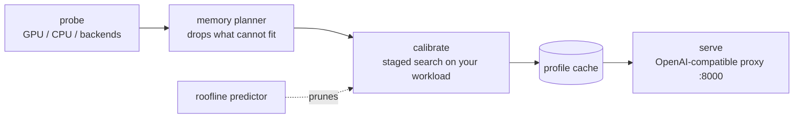

# PolyServe

[](https://github.com/Aagam-Bothara/polyserve/actions/workflows/tests.yml)

**PolyServe measures which serving settings pay off on your GPU and your traffic, then serves the winner.** Give it a model: it probes the machine, benchmarks vLLM, SGLang and llama.cpp configurations on your workload, and serves the pick behind an OpenAI-compatible API. Calibration measures speed and latency only; what a quantization costs in answer quality is measured separately, with `benchmarks/task_quality.py`.

The claim is deliberately narrow. Against stock settings it wins clearly. Against an expert who already passes the right flags it mostly ties, except where the best settings depend on what the traffic contains. That is where the search earns its keep.

## Results

Qwen2.5 models on rented GPUs, objective `balanced`, PolyServe's default `--quant auto` (no 4-bit weights), vLLM 0.29 on the A40 and vLLM 0.11 on the L4. Every row except your own prompts is a single run. The latency ceiling is judged on the 95th-percentile time to first token, PolyServe's default now. These runs were judged by the median, so the numbers are **re-scored** from the same recorded measurements with `benchmarks/rescore_ttft.py`, not re-measured; where that changed a number, the median's follows in brackets. The picks are the ones the median chose, and a calibration judged at p95 could choose differently. Full tables, per-strategy ablations and methods are in [docs/benchmarks.md](docs/benchmarks.md).

| Machine, model | Workload | PolyServe pick | vs stock `vllm serve` | vs stock with `--quantization fp8` |
|---|---|---|---|---|
| A40, 3B | `extract` (copy facts out of news articles) | bf16 + 0.5B draft model | **+66.5%** | stock fp8 fails to start (vLLM 0.29 on Ampere) |
| A40, 3B | `sharegpt` (real chat first turns) | bf16 + fp8 KV cache, batch 512 | +10.3% | fails to start |
| A40, 3B | `code-edit` (add type hints to functions) | bf16 + fp8 KV cache | +5.2%† | fails to start |
| A40, 3B | **your own prompts** (300 from Dolly-15k, `--workload-file`), vLLM and SGLang both candidates | vLLM bf16 + fp8 KV cache + 0.5B draft model | **+10.3%**, and +15.6% over stock SGLang; 3 interleaved runs each, ranges do not overlap | fails to start |
| L4 24 GB, 7B | `chat` | fp8 weights | stock misses the 50 ms/token target at any load | tie, 107 tok/s at 4 users (195 at 8) |
| L4 24 GB, 7B | `sharegpt` | fp8 weights + fp8 KV cache | +63%, 212 tok/s at 8 users (+80%, 738 at 32) | tie (+5.3%†) |
| CPU container (7.65 cores), 0.5B | `default` | llama.cpp, 1 slot + n-gram speculation | misses the 500 ms ceiling by 18 ms at p95, which stock `llama-server` meets (+36.5% by the median*) | |

\* Synthetic prompts, which flatter n-gram speculation; treat it as an upper bound.

† A single run, inside the run-to-run spread that repeated runs showed on real text (up to about 6%), so not yet a reliable gain; `compare --repeats 3` would settle it.

- **The right precision depends on the card and the latency target.** On the L4, fp8 beat 4-bit because 4-bit's slower prefill broke the first-token target; on the A40, where vLLM 0.29 offers no fp8, 4-bit ran at twice bf16.
- **Quality was measured, in a separate experiment.** `benchmarks/task_quality.py` graded all 1,319 GSM8K problems at each precision, paired against bf16: on Qwen2.5-3B fp8 cost 2.4 points and 4-bit 4–5 (all significant); on 7B none cost a measurable amount. That is why `--quant auto` leaves 4-bit out; `--quant auto,awq,gptq` puts it back (it doubled throughput on real text). PolyServe does not grade answers while it calibrates, so `--quant` is where you decide what it may trade.
- **Judged by the tail, a card promises less.** By the median, 8 of 20 recorded picks sent more than 1 request in 20 past the time-to-first-token ceiling; at p95 they serve fewer users at once (the L4 on `sharegpt`: 738 tok/s at 32 users, 212 at 8). Stock settings queue worse at the tail as often as not, so the lead over stock grew in some rows (on an A40 on `high-concurrency`, +6% became +20%) and vanished in others (stock fp8 on the L4). [The re-scored tables](docs/benchmarks.md#judged-at-the-95th-percentile).
- **Some strategies only pay together, and some get in each other's way.** On `extract` the fp8 cache helped on its own but slowed the draft model. The search finds that by undoing each change it adopted.
- **Speculative decoding depends on load and content.** n-gram lookup made one user 80% faster on code edits and collapsed from four users up. PolyServe measures at your workload's concurrency.

## Quickstart

```bash
pip install git+https://github.com/Aagam-Bothara/polyserve.git   # not on PyPI yet
pip install "vllm==0.29.0"     # driver 580+; older drivers: "vllm==0.11.0" "transformers>=4.56,<5"
polyserve serve Qwen/Qwen2.5-3B-Instruct --workload chat
curl localhost:8000/v1/chat/completions -H 'content-type: application/json' \
  -d '{"model":"Qwen/Qwen2.5-3B-Instruct","messages":[{"role":"user","content":"hi"}]}'
```

The first launch calibrates, which takes 20–45 minutes, and caches the result per machine, model, objective and workload. Later launches serve at once. To tune for your own traffic instead of a preset, pass a sample of it: `--workload-file prompts.jsonl`. `--skip-calibration` serves the first candidate with default settings. For llama.cpp, build `llama-server` with CUDA and put it on `PATH` or in `LLAMA_SERVER`. SGLang and vLLM pin their shared dependencies differently from release to release, so SGLang can live in a separate environment: set `SGLANG_PYTHON` to that environment's `python`, and calibration can still choose between it and vLLM. `pip install arctic-inference==0.1.1` adds vLLM's suffix decoding to the speculative methods tried.

With Docker. The image builds on the official vLLM image; CI builds the same Dockerfile on a slim Python base to check its steps, but not the full vLLM image:

```bash
docker build -t polyserve .
docker run --gpus all --ipc=host -p 8000:8000 -v ~/.cache/huggingface:/root/.cache/huggingface \
  -v ~/.polyserve:/root/.polyserve polyserve serve Qwen/Qwen2.5-3B-Instruct
```

## Supported hardware

| Hardware | Backends tried | Measured |
|---|---|---|
| NVIDIA, compute capability ≥ 7.5 | vLLM, SGLang, llama.cpp (CUDA) | vLLM 0.11 and 0.29 and llama.cpp on an A40 and an L4, two-GPU layouts on a pair of A40s; SGLang 0.5.19 on an A40 (from its own environment via `SGLANG_PYTHON`) |
| NVIDIA, compute capability < 7.5 | llama.cpp (CUDA) | **never benchmarked** |
| x86 CPU | llama.cpp; vLLM-CPU with AVX-512 | llama.cpp in a CPU container; vLLM-CPU **never benchmarked** |

Linux, Python 3.10–3.13.

## How it works



1. **Probe** the GPU, VRAM, CPU cores (within a container's quota) and installed backends.
2. **Plan**: estimate weights + KV cache + workspace for every candidate and drop what will not fit.
3. **Calibrate** on your workload in stages: precision, memory, batch, prefill budget, KV-cache type, prefix caching, speculative decoding, then combinations, including the leader with each adopted change undone. A backend that falls far behind stops being measured; every engine within 10% of the leader after the batch stage goes through the later stages too, with its own settings. Last, the best three are measured again and the pick is made on those fresh runs.
4. **Cache** the chosen configuration with its full calibration table.
5. **Serve** it as a supervised process behind a proxy on `:8000`; `/polyserve/profile` shows what runs and why.

Every step, workload and option is described in [docs/usage.md](docs/usage.md).

## Main options

| Option | Default | Choices |
|---|---|---|
| `--workload` | `default` | `chat`, `generation`, `rag`, `long-context`, `high-concurrency`, shared-prefix `chat-system` and `rag-shared`, real-text `sharegpt`, `extract` and `code-edit` |
| `--workload-file` | none | your own prompts, one per line of a JSONL file; `--workload` then sets only the concurrency levels and latency ceilings |
| `--objective` | `balanced` | `throughput`, `latency`, `balanced` (throughput under a time-to-first-token ceiling), `efficiency` |
| `--ttft-percentile` | `95` | `50` judges the ceiling on the median instead, which lets half the requests run past it |
| `--quant` | `auto` | weight precisions to consider; the Hub's 4-bit AWQ/GPTQ and 8-bit W8A8 checkpoints are opt-in (`auto,awq,gptq,w8a8`) |
| `--kv-quant`, `--prefix-cache`, `--speculative`, `--combine`, `--confirm` | `on` | `off` rules a search stage out |
| `--layout` | `single` | `replicas`, `tp` or `auto` across several GPUs |
| `--budget` | none | stop calibrating after about this long (`10m`, `1h`); the profile lists what was skipped. With a budget the variations (KV-cache type, prefix caching, speculative decoding) run straight after the precision stage, because on Dolly prompts a 10-minute budget spent in the old order stopped before them and served at stock speed |

The full CLI is in [docs/usage.md](docs/usage.md#cli).

## Limits

- Against someone who already picks the right precision and flags, the rest of the search is worth a few percent, except where content decides, as on `extract`.
- Never run on real hardware: vLLM-CPU, pre-Turing GPUs, and `--power`, which has only run against a simulated NVML. The start-up out-of-memory retry has not been triggered on a GPU, because the shape that failed on vLLM 0.11 starts on 0.29.
- The later search stages tune every engine within 10% of the leader after the batch stage; one further behind is never tried with the options that later helped the leader. This, the budget's new order and the p95 rule have run in tests only, not yet in a calibration on a GPU.
- Calibration never evaluates answer quality. The quality results above come from a separate script, run by hand, on one task (GSM8K) and one model family.
- Measured on one model family (Qwen2.5) and three machines.
- Calibration takes tens of minutes per workload. Each trial now measures its busiest level first and stops once one meets the objective; replayed over six recorded calibrations, that cuts about a third of the time (29–44%) without changing a pick, but it has not been timed on a GPU. `--budget 10m` caps it further; whether the new order finds the variations that paid on real text (the fp8 cache, a draft model) inside ten minutes is unmeasured.

What is still unmeasured, in order of how much it could change the conclusions: [docs/benchmarks.md](docs/benchmarks.md#not-yet-measured).

## Documentation

- [docs/usage.md](docs/usage.md): how calibration works, workloads, objectives, every search option, the CLI and the backend interface.
- [docs/benchmarks.md](docs/benchmarks.md): every measured result, with methods, ablations, quality, and the planner's and predictor's accuracy.
- [docs/writeup.md](docs/writeup.md): the design of the memory planner, the staged search and the predictor.
- [benchmarks/strategies/SUMMARY.md](benchmarks/strategies/SUMMARY.md): every table, regenerated from the raw JSON.

## Non-goals and roadmap

PolyServe sits above the inference engines (vLLM, SGLang and llama.cpp) and launches them; it is not a replacement, a compiler or a kernel library, and it supports only the hardware listed above. Planned: AMD ROCm and Apple Silicon backends, Windows, and re-tuning under live traffic instead of a one-time calibration.

## Development

```bash
pip install -e ".[dev]"
pytest                                  # no GPU or backend needed
ruff check polyserve tests benchmarks
```

See [CONTRIBUTING.md](CONTRIBUTING.md).

## License

MIT
