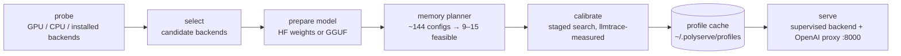

# PolyServe

**PolyServe is a hardware-adaptive LLM serving runtime that automatically selects and tunes the best available inference backend for your machine.** One command, one OpenAI-compatible API, no backend or quantization configuration required.

```bash
pip install polyserve
polyserve serve meta-llama/Llama-3.2-3B-Instruct            # --objective balanced
curl localhost:8000/v1/chat/completions -d '{"model":"meta-llama/Llama-3.2-3B-Instruct","messages":[{"role":"user","content":"hi"}]}'
```

First launch: discover hardware → prepare model → calibrate once → serve.
Later launches: load the cached profile → serve.

PolyServe is not a new inference engine. It sits above vLLM, SGLang and llama.cpp and answers the question every deployment starts with: *which backend, which quant, which memory / batch settings, on this box, for this objective?* It answers it by measuring, not by guessing.

---

## Supported matrix (v1)

| Hardware | Backends tried |
|---|---|
| NVIDIA, compute capability ≥ 7.5 (Turing and newer) | vLLM, SGLang, llama.cpp (CUDA) |
| NVIDIA, compute capability < 7.5 (Pascal, Volta) | llama.cpp (CUDA) |
| x86 CPU | llama.cpp; vLLM-CPU if AVX-512 is present |

Linux, Python 3.10–3.13. A backend is in v1 only if it gets a row in the benchmark table.

Each backend is a subprocess PolyServe launches with tuned arguments; you install the ones you want:

```bash
pip install polyserve[nvml]          # + NVML telemetry (power, utilisation) for calibration
pip install vllm                     # or sglang, or build llama.cpp and put llama-server on PATH
export LLAMA_SERVER=/path/to/llama-server   # optional, if not on PATH
```

---

## How it works



1. **Probe** — `HardwareDescriptor`: GPU vendor/name/compute capability/VRAM, CPU cores + AVX2/AVX-512, RAM, and which of vLLM / SGLang / llama.cpp / vLLM-CPU are actually runnable here. (`polyserve probe`)
2. **Select** — the rules in the table above. Multiple candidates are allowed; calibration picks the winner.
3. **Prepare** — vLLM/SGLang use HF weights as-is. llama.cpp resolves a pre-quantised GGUF from the Hub (Q4_K_M, Q5_K_M, Q6_K, Q8_0), or converts + quantises FP16 itself, and only for the quants the planner keeps.
4. **Memory planner** — before any process is launched:
   `estimated = weights + kv_cache(ctx, batch, dtype) + runtime_workspace + safety_margin`, keep a config only if `estimated ≤ 0.95 × available`. This prunes the grid from ~144 points to a dozen. (`polyserve plan <model>`)
5. **Calibrate** — a staged search, not a grid: (1) one short run per quant, keep the top two; (2) largest safe memory config; (3) batch / concurrency sweep. Each trial replays a fixed synthetic workload (16 prompts × 256-token prefill × 128-token decode at concurrency 1/4/8, ~10 s) and is measured with [llmtrace](https://github.com/Aagam-Bothara/llmtrace): tok/s, TTFT, TPOT, peak memory, GPU utilisation, power.
6. **Cache** — `~/.polyserve/profiles/<hardware_hash>/<model>/<objective>.json` holds the winner, the full launch args, the whole calibration table, and versions. Invalidated when the hardware or backend version changes; `polyserve recalibrate` forces a rerun.
7. **Serve** — the winner runs as a supervised subprocess (health check + auto-restart). A thin proxy on `:8000` exposes `/v1/chat/completions`, `/v1/completions`, `/v1/models` (streaming passthrough) and `/polyserve/profile`, which returns the active configuration and calibration table.

### Objectives

All four are constrained argmax. There is no weighted score formula in v1.

| `--objective` | Rule |
|---|---|
| `throughput` | max tok/s |
| `latency` | min TTFT s.t. tok/s ≥ floor |
| `balanced` (default) | max tok/s s.t. TTFT ≤ ceiling (500 ms; `--ttft-ceiling`) |
| `efficiency` | min joules/token s.t. tok/s ≥ floor |

The floor defaults to 50% of the best observed tok/s (`--tok-s-floor` for an absolute value). If nothing satisfies a constraint, the least-violating config wins and the profile says so.

---

## CLI

```
polyserve serve <model> [--objective X] [--port N] [--backend NAME] [--skip-calibration]
polyserve probe                 # print HardwareDescriptor
polyserve plan <model>          # print feasible configs without running them
polyserve bench <model>         # run calibration and print the table, don't serve
polyserve recalibrate <model>   # force a rerun and overwrite the cached profile
polyserve profiles              # list cached profiles
```

`--skip-calibration` serves the first candidate backend with sane defaults immediately; nothing is cached.

---

## Benchmarks

PolyServe auto-config vs. Ollama defaults vs. stock vLLM / llama.cpp defaults. Workload: 16 prompts × 256 prefill × 128 decode, concurrency 8, `--objective balanced`. Measured with llmtrace.

| Machine | Model | Runtime / config | tok/s | TTFT p50 (ms) | peak mem (GB) | W | J/token |
|---|---|---|---|---|---|---|---|
| A100 80 GB | Llama-3.2-3B-Instruct | PolyServe (auto) | _pending_ | | | | |
| | | vLLM defaults | _pending_ | | | | |
| | | Ollama defaults | _pending_ | | | | |
| RTX 4090 | Llama-3.2-3B-Instruct | PolyServe (auto) | _pending_ | | | | |
| | | vLLM defaults | _pending_ | | | | |
| | | Ollama defaults | _pending_ | | | | |
| GTX 1080 / CPU box | Llama-3.2-3B-Instruct | PolyServe (auto) | _pending_ | | | | |
| | | llama.cpp defaults | _pending_ | | | | |
| | | Ollama defaults | _pending_ | | | | |

Numbers land here from `polyserve bench` on the three lab machines (week 6). Until then every cell is _pending_, not a claim.

---

## Backend interface

New hardware is a new class, no core changes:

```python
class Backend(Protocol):
    name: str
    def available(self, hw) -> bool
    def supports(self, hw, model) -> bool
    def prepare(self, model, hw) -> PreparedModel
    def materialize(self, model, quants) -> PreparedModel      # download / convert only what survived planning
    def memory_model(self, hw) -> MemoryModel                  # workspace constant + KV-token rule
    def estimate_memory(self, cfg, model, hw) -> int
    def candidate_configs(self, hw, model) -> list[Config]
    def launch(self, cfg, model, port) -> Process
    def workload_hooks(self, hw, model) -> LlmtraceHooks
```

v1 implementations: `VllmBackend`, `SglangBackend`, `LlamaCppCudaBackend`, `LlamaCppCpuBackend`, `VllmCpuBackend` in [polyserve/backends/](polyserve/backends/).

---

## Roadmap (not in v1)

- AMD / ROCm (vLLM-ROCm, llama.cpp HIP) — new `Backend` classes.
- Apple Silicon — MLX and llama.cpp Metal.
- Windows.
- Live re-tuning under real traffic instead of a one-time synthetic calibration.
- Custom kernels. PolyServe will keep sitting above the engines, not inside them.

## Non-goals

- **Not a replacement for vLLM / SGLang / llama.cpp.** It sits above them and launches them.
- **Not a compiler.** It is a benchmark-driven configuration planner.
- **Does not promise every machine.** The supported matrix above is explicit; anything else is a plugin.

## Development

```bash
pip install -e .[dev]
pytest            # all tests run without a GPU or any backend installed
```

Technical notes on the memory planner, staged search and energy objective: [docs/writeup.md](docs/writeup.md).

## License

MIT
