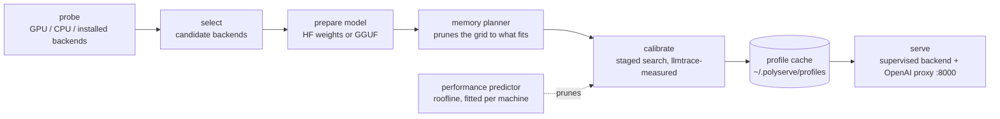

# Using PolyServe

The full reference behind the [README](../README.md): how calibration works, every workload, objective and search option, the CLI, and the backend interface. Measured results are in [benchmarks.md](benchmarks.md).

## How it works



1. **Check your hardware.** PolyServe detects your GPU, its compute capability and VRAM, CPU cores and AVX2/AVX-512 support, RAM, and which backends can run. Use `polyserve probe` to inspect the resulting `HardwareDescriptor`.

2. **Choose candidate backends.** The [supported-hardware table](../README.md#supported-hardware) determines which backends to try. If several are available, calibration decides which one to use.

3. **Prepare the model.** vLLM and SGLang use Hugging Face weights directly, plus any pre-quantized 4-bit AWQ or GPTQ checkpoint of the same model found on the Hub. For llama.cpp, PolyServe finds a pre-quantised GGUF on the Hub (Q4_K_M, Q5_K_M, Q6_K or Q8_0), or converts and quantises FP16 weights locally. It only prepares the quantizations that pass memory planning.

4. **Check what fits in memory.** Before launching a backend, the planner estimates its memory needs:

   `estimated = weights + kv_cache(ctx, batch, dtype) + runtime_workspace + safety_margin`

   It keeps a configuration only if `estimated ≤ 0.95 × available`. On a 24 GB card, this reduced 54 vLLM candidates to 48 for a 3B model at 4k context, and to 18 at 32k. None of the admitted configurations ran out of memory in that run. Use `polyserve plan <model>` to see what fits before launching anything.

   Each trial records the estimate alongside measured peak memory from NVML and the backend's own weight, KV cache and workspace figures. `polyserve memory-report` shows the errors by backend. Add `--apply` to replace the initial workspace constant and 5% margin with values fitted to your machine.

5. **Benchmark the candidates.** Calibration starts with a short run per quantization and keeps the top two. It then selects the largest safe memory configuration and tries different batch sizes and concurrency levels. Later stages try variations of the leader: the prefill knob, a quantized KV cache, prefix-cache settings and speculative decoding (see [Search options](#search-options)). Every other engine whose best configuration is within 10% of the leader after the batch stage gets the same stages on that configuration, so a runner-up that gains more from, say, a quantized cache can still overtake; a variation is never carried from one engine to another. A final stage, again per engine, measures its leader with each adopted variation undone, then combinations of the variations that came within 5% of the leader on their own, since some strategies only pay together and some get in each other's way. Last, the leader and up to two other configurations within 10% of it are measured again, one after another, and the pick is made on those runs alone. Choosing the best of many noisy trials flatters the winner (on Dolly-15k prompts the pick measured 603 tok/s in calibration and 547 re-measured), so the profile reports the re-measured number. `--confirm off` skips it.

   A performance predictor helps narrow the search. Its roofline model accounts for weight and KV bandwidth, decode and prefill compute, and queueing beyond the available slots. `polyserve fit` fits three efficiency parameters per backend using your machine's trials. The predictor skips quantizations expected to perform far below the best and tests promising batch settings first. Measurements prune too: once even a backend's best raw throughput is less than half of what a leader reached within the objective's constraints, its remaining quantizations are skipped. Only a configuration that meets the constraints can lead, so under `balanced` a fast configuration that breaks the TTFT ceiling never pushes out a slower backend that meets it. On ShareGPT prompts on an A40, llama.cpp's first reached 470 tok/s against vLLM's 1677, and its other three would have taken 25 minutes to lose. `polyserve predict` shows the predictions without launching a backend; `fit` reports leave-one-out error and rank correlation so you can check their accuracy.

   Each trial replays a fixed workload, synthetic unless you pick a real-text preset. The default uses 16 prompts, a 256-token prefill and a 128-token decode at concurrency 1/4/8, taking roughly 10 seconds. Under `throughput` and `balanced` a trial measures its busiest level first and stops at the first level that meets the objective's limits: it scores at its fastest such level, and throughput rises with load, so a quieter level cannot beat it. Replayed over six recorded calibrations (115 trials) that changed no score and no pick and skipped about a third of calibration time ([details](benchmarks.md#measuring-the-busiest-level-first)). `latency` and `efficiency` can prefer a quieter level, and a power stage compares energy per token over every level, so those measure all of them. On the real-text presets answers end when the model stops, so a level at concurrency c sends a few requests per slot (at least 8) rather than every prompt: sending all 64 ShareGPT prompts one at a time took most of an 8-minute trial. Energy per token is averaged over every level, so on these presets it weighs the busy levels more and reads lower (one A40 configuration: 1.41 J/tok sending every prompt, 0.53 with the cap); compare it only between trials of the same workload. Each concurrency level gets fresh prompts, so a level never measures a prefix cache the previous level filled; only a workload's deliberately shared prefix repeats. [llmtrace](https://github.com/Aagam-Bothara/llmtrace) measures tokens per second, time to first token (TTFT), time per output token (TPOT), peak memory, GPU utilisation and power.

6. **Save the results.** The chosen configuration, full launch arguments, calibration table and versions are saved in `~/.polyserve/profiles/<hardware_hash>/<model>/<objective>[-<workload>].json`. A hardware or backend version change invalidates the profile. You can also force a fresh run with `polyserve recalibrate`.

7. **Start serving.** PolyServe runs the chosen backend as a supervised process, with health checks and automatic restarts. A proxy on `:8000` exposes `/v1/chat/completions`, `/v1/completions` and `/v1/models`, with streaming passthrough. Visit `/polyserve/profile` to see the active configuration and calibration table.

### Workloads

An interactive chat and a long document query need different settings. Use `--workload` to choose the traffic used during calibration. Each preset has a time-to-first-token (TTFT) limit for the `balanced` objective. PolyServe caches profiles separately for each workload, so `serve --workload rag` and `serve --workload chat` each get their own calibration.

| `--workload` | prefill | decode | concurrency | TTFT ceiling | shaped like |
|---|---|---|---|---|---|
| `default` | 256 | 128 | 1 / 4 / 8 | 500 ms | the spec's calibration workload |
| `chat` | 512 | 128 | 1 / 4 / 8 | 500 ms | assistant turns |
| `long-context` | 8192 | 256 | 1 / 2 / 4 | 2000 ms | document Q&A, summarisation |
| `generation` | 128 | 1024 | 1 / 4 / 8 | 500 ms | code / story generation |
| `high-concurrency` | 256 | 64 | 32 / 64 / 128 | 1000 ms | many short requests |
| `rag` | 6144 | 64 | 1 / 4 / 8 | 1500 ms | retrieval-augmented answers |
| `chat-system` | 2048, 1536 of it shared | 128 | 1 / 4 / 8 | 500 ms | a long system prompt on every turn |
| `rag-shared` | 6144, 5632 of it shared | 64 | 1 / 4 / 8 | 1500 ms | many questions about one document |
| `sharegpt` | real, up to 1024 | natural, up to 512 | 1 / 8 / 32 | 1000 ms | first turns of real ChatGPT conversations (ShareGPT) |
| `extract` | real, up to 1536 | natural, up to 384 | 1 / 4 / 8 | 1500 ms | copy the sentences with a number out of a news article (CNN/DailyMail) |
| `code-edit` | real, up to 768 | natural, up to 512 | 1 / 4 / 8 | 500 ms | add type hints to a Python function (HumanEval) |

In the two shared-prefix presets every prompt starts with the same text, which is where prefix caching pays: only the first request should prefill it. The warmup sends that same prefix, so trials measure a warm cache, as production traffic would see.

The last three use real text, downloaded from the Hub on first use, and let the model stop when it is done instead of forcing a fixed answer length. They exist for strategies whose value depends on content: n-gram speculation pays when the answer repeats the prompt, as extraction and code edits do, and random words cannot show that.

#### Your own prompts

The measured results say the best settings depend on what the traffic contains (a draft model added 66% on `extract` and nothing on `sharegpt`), so the most faithful workload is a sample of your own. Pass one with `--workload-file`:

```bash
polyserve serve Qwen/Qwen2.5-3B-Instruct --workload chat --workload-file prompts.jsonl
```

- The file is JSONL, one prompt per line: a JSON string, `{"prompt": "..."}`, `{"text": "..."}` or `{"messages": [{"role": "user", "content": "..."}]}`. A conversation's messages are joined in order; no chat template is applied, as with the built-in real-text presets. A bad line is reported with its line number.
- `--workload` becomes a template: its concurrency levels and latency ceilings apply, and answers stop when the model does, up to 512 tokens.
- The profile's name includes a hash of the file, so editing the file triggers a fresh calibration instead of reusing a profile tuned for the old prompts.
- Every concurrency level gets prompts of its own, so no level measures a prefix cache an earlier level filled. A file with too few prompts for that sends fewer requests per level and says so; a few hundred prompts is plenty for the presets' levels.
- `benchmarks/ablate_strategies.py --workload-file` breaks the resulting pick down by strategy, as for the presets.

This is new and so far exercised by tests only; it drives the same real-text harness as `sharegpt`, `extract` and `code-edit`, which has run on GPUs.

Prompt lengths are exact when the model's tokenizer is available (prompts are fitted to the target token count), and output tokens are counted from the server's `usage` or the tokenizer, never from stream chunks. The planner drops any config whose context cannot hold prefill + decode.

```bash
polyserve serve meta-llama/Llama-3.2-3B-Instruct --workload chat
polyserve serve meta-llama/Llama-3.2-3B-Instruct --workload rag
polyserve serve meta-llama/Llama-3.2-3B-Instruct --workload long-context
```

### Objectives

Choose what you want to optimise. PolyServe ranks configurations using the rules below, rather than combining the measurements into a weighted score.

| `--objective` | Rule |
|---|---|
| `throughput` | Highest tokens per second |
| `latency` | Lowest request latency (TTFT + TPOT × output tokens) while meeting the minimum tokens per second |
| `balanced` (default) | Highest tokens per second while the 95th-percentile TTFT stays within the workload's limit; override the limit with `--ttft-ceiling`, or judge it on the median with `--ttft-percentile 50` |
| `efficiency` | Lowest joules per token while meeting the minimum tokens per second |

Every objective also respects a per-token latency (TPOT) ceiling, the decode-phase counterpart of the TTFT limit. Each workload carries one (50 ms for `chat`, `chat-system`, `generation`, `extract` and `code-edit`, 150 ms for `high-concurrency`, 100 ms otherwise) and `--tpot-ceiling` overrides it, so no configuration can win by starving either phase.

`latency` used to rank by TTFT alone. It now counts the whole answer, because speculative decoding leaves TTFT unchanged and cuts time per token, and a TTFT-only rule could never pick it. Profiles cached under the old rule should be recalibrated.

`balanced` used to judge its ceiling on the median TTFT, which lets half the requests run past it. In 8 of 20 recorded comparisons the load chosen that way sent more than 1 request in 20 over the ceiling, so the 95th percentile is now the default ([re-scored results](benchmarks.md#judged-at-the-95th-percentile)). A `balanced` profile picked by the median is not served under the new rule, so each recalibrates once; `--ttft-percentile 50` still serves it.

Scores within 2% of each other count as a tie. A tie goes to the configuration that switches on fewer optional strategies (a quantized KV cache, speculative decoding, a non-default prefill budget, llama.cpp's prefix flags), so a strategy is adopted only when it measurably wins. After that, the larger context and batch win, then the lower energy per token.

The minimum throughput defaults to 50% of the best observed tokens per second. Set `--tok-s-floor` to use an absolute value instead. If no configuration meets the constraint, PolyServe chooses the one that comes closest and records that in the profile.

### Energy tuning: power cap and clock lock

LLM decode is memory-bandwidth bound. Past a certain core clock the SMs wait on memory, so extra frequency buys almost no throughput while power keeps rising. `--power` adds a fourth calibration stage that looks for that point on the winning configuration:

| `--power` | What it sweeps |
|---|---|
| `off` (default) | nothing |
| `cap` | board power limit at 85%, 70% and 55% of the default |
| `clock` | locked SM clock at 85%, 70% and 55% of the maximum, snapped to supported steps |
| `both` | both sets: six points, not the cross product |

Both knobs are applied through NVML to the already-running server, so the sweep needs a single launch and every point shares the same warm engine. The objective then decides. `efficiency` takes the lowest joules per token above its throughput floor. `balanced`, `latency` and `throughput` only accept a setting whose throughput is within 2% of the uncapped result, so the energy saving costs no measurable speed unless you ask for that trade. The chosen setting gets its own cached profile, is applied when `polyserve serve` starts, and appears at `/polyserve/profile`. Every trial also records the mean SM clock, which confirms that a lock actually took effect.

Changing power or clocks needs root and affects the whole machine. PolyServe writes the original state to `~/.polyserve/power-restore.json` before the first change, restores it on exit and on SIGTERM, and `polyserve power reset` undoes it after a hard kill. `polyserve power status` shows the card's limits and whether control is permitted; when it is not, calibration records the reason and skips the stage instead of failing. **This stage is implemented and tested against a simulated NVML, and has not yet run on real hardware.**

### Prefill and decode

Prefill, which processes the prompt, is compute bound. Decode, which generates tokens, is memory-bandwidth bound. They want different settings, so PolyServe tunes them separately, and `--phases` chooses how:

| `--phases` | What happens |
|---|---|
| `unified` (default) | One engine. The batch-size sweep tunes decode concurrency; a prefill stage then sweeps the prefill knob on the winner: vLLM's chunked-prefill budget (`--max-num-batched-tokens` 2048, 8192, 16384), SGLang's `--chunked-prefill-size`, or llama.cpp's micro-batch (`-ub` 256, 1024, 2048). |
| `disaggregated` | Two vLLM engines on two GPUs, joined by KV-cache transfer (NixlConnector by default; `--kv-connector`). The prefill engine gets a large prefill budget and few sequences, the decode engine many sequences and a small budget, and with `--power` only the decode GPU is capped. A router sends each request to the prefill engine for one token, takes the KV handle it returns, and streams the decode engine's output to the client. |
| `auto` | Calibrates unified, measures the disaggregated pairs, and keeps whichever wins under the objective. On a machine that cannot disaggregate it serves unified and records why. |

Disaggregation needs vLLM, two NVIDIA GPUs and the connector's package (`pip install nixl`). With `--phases disaggregated`, PolyServe checks all three before spending a calibration and refuses with the reason. Each engine's settings, the GPU split and the connector are cached in the profile, shown at `/polyserve/profile`, and restarted together if either engine dies. The disaggregated mode has run on two PCIe-linked A40s with NixlConnector (vLLM 0.11, nixl 1.4.1). On a 3B model and the `rag` workload it lost to a single engine (102 against 105 tok/s, time to first token 3.1 s against 1.3 s), so `--phases auto` served unified, as designed. One of the two pairs tried failed a quarter of its requests because the decode engine never pulled their KV blocks.

### Search options

The [benchmarks](benchmarks.md) show where the GPU gain comes from: fewer bytes per weight, since every decode step reads all of them. The first four options follow that lead, and the fifth adds GPUs. Each one adds a calibration stage on the current leader (and on any engine within 10% of it), and the objective decides whether the leader changes, so a strategy that loses on your machine is measured and dropped rather than assumed.

| Option | Default | What it adds |
|---|---|---|
| `--quant auto\|<list>` | `auto` | Which weight precisions calibration may choose. `auto` is every precision the backend supports except 4-bit AWQ and GPTQ checkpoints, which are opt-in: `--quant auto,awq,gptq` adds them, and `--quant gptq` allows only that. `w8a8` adds an 8-bit checkpoint with int8 weights and int8 activations (compressed-tensors, as Red Hat publishes for Qwen2.5 0.5B–7B), accepted only when its `quantization_config` says so: the 8-bit option on Ampere, where vLLM 0.29 cannot quantize weights to fp8 itself, since its int8 kernels need only compute capability 7.5. It is opt-in until its quality is measured, and it has not yet run on a GPU. When they are allowed, PolyServe finds a pre-quantized repository of the same model on the Hub (the model's author first, then known quantizers), confirms from its `quantization_config` that it really is 4-bit, and sizes it from its files. They are opt-in because of quality: on Qwen2.5-3B they cost 4–5 points of GSM8K accuracy, where fp8 cost 2.4, in exchange for 31–40% more throughput than fp8 at the same settings. On Qwen2.5-7B they cost about one point, within noise. `--quant bf16` rules out any quality change from quantization. llama.cpp's GGUF quantizations stay in `auto`, since they are the only formats that backend runs (Q4_K_M cost 10% against Q8_0). vLLM's fp8 weights are offered on Ada and Hopper, and on Ampere only up to vLLM 0.28: on an A40, vLLM 0.29 failed to start an fp8 model, in torch.compile by default and in its CUTLASS sm80 kernel with compilation off. |
| `--kv-quant on\|off` | `on` | A quantized KV cache: fp8 on vLLM (e4m3 on Ada and Hopper; on Ampere, e5m2 through FlashInfer when it is installed, because vLLM 0.11's default Triton attention cannot build fp8 KV kernels there; selected with `--attention-backend` where vLLM has it), fp8_e5m2 on SGLang, q8_0 and q4_0 on llama.cpp. On vLLM 0.29 and later it also tries int8 with a scale per token and head (`int8_per_token_head`, through Triton attention, no calibration data needed), which runs on Ampere cards without FlashInfer too; what it costs in answer quality has not been measured, and `--kv-quant off` rules out every quantized cache. The memory planner sizes each cache type exactly, and the stage also tries the next batch size up when only the smaller cache makes it fit. |
| `--prefix-cache on\|off` | `on` | Keeps vLLM's prefix caching and SGLang's radix cache on. On the shared-prefix workloads it also tries llama.cpp's `--cache-reuse` and `--kv-unified`. `off` disables the cache everywhere, for measuring what it is worth. |
| `--speculative on\|off` | `on` | Speculative decoding: n-gram lookup, which needs no second model, on vLLM and on recent llama.cpp builds (`--spec-type ngram-mod`), and a small draft model of the same family (for example Qwen2.5-0.5B for the larger Qwen2.5 models, Llama-3.2-1B for Llama 3.x) on llama.cpp, and on vLLM 0.29, where it started and served in a smoke test (vLLM 0.11 rejects a separate draft model). Measured on an A40, the two engines disagreed. vLLM's n-gram lookup, which matches only the prompt, lost at every concurrency from 1 to 64 and was never picked. llama.cpp's `ngram-mod`, which also matches text the model has already generated, won on `chat-system`: time per token fell from 16.3 to 6.8 ms. These synthetic answers probably repeat themselves more than real ones, so treat that gain as an upper bound. The Qwen2.5-0.5B draft model on llama.cpp lost 34% in a smoke test. On vLLM 0.29 and later the n-gram lookup runs on the GPU (`ngram_gpu`, same lookup settings): vLLM 0.29 turns async scheduling off for its CPU n-gram proposer and keeps it for `ngram_gpu` and draft models, and whether that explains the collapse is not yet measured. Suffix decoding (NeurIPS 2025), which also matches text the model has already written and adapts how many tokens it proposes, is tried on vLLM once `pip install arctic-inference==0.1.1` has been run. |
| `--layout single\|replicas\|tp\|auto` | `single` | Multi-GPU arrangement. `replicas` runs one engine per GPU behind a least-outstanding-requests load balancer; `tp` shards one engine across the GPUs with tensor parallelism (vLLM, SGLang). `auto` measures both against the single-GPU winner and keeps the best. Replicas and tensor parallel are compared through the same balancer and workload, and a replicas profile is served by the balancer on `:8000`. On GPUs without NVLink, tensor-parallel launches set `NCCL_P2P_DISABLE=1` and `--disable-custom-all-reduce`; without both, vLLM hung at start-up on a pair of A40s. Measured there: two replicas gave 1.74× one GPU on `high-concurrency`, and tensor parallel over PCIe was slower than one GPU. |
| `--combine on\|off` | `on` | After the one-setting-at-a-time stages, first measure the leader with each change it adopted undone, then combinations of the changes that came within 5% of the leader on their own (at most one value per setting, up to 8 trials in all, best estimated gain first). One setting at a time missed llama.cpp's `--kv-unified` with n-gram speculation, a pair that measured 12.7% better than the pick, and on `extract` it adopted the fp8 KV cache before a draft model that ran 19% faster without it; this stage looks for both, and on a rerun of `extract` it found the second, 19% faster than the earlier pick. |
| `--confirm on\|off` | `on` | After every other stage, measure the leader and up to two other configurations within 10% of it once more each, in turn, and choose on those runs alone; the profile's notes give the pick's number from the search and from its re-measurement. It costs up to three trials. Of five picks that `compare` re-measured before this stage existed, four came within 1.4% of their calibration number and one (Dolly-15k) measured 9.3% lower. |
| `--budget 90s\|10m\|1h` | none | Stop starting trials once a typical trial would end past the budget. With a budget the variations (KV-cache type, prefix caching, speculative decoding) run straight after the precision stage, on every engine within 10% of its leader, and the memory and batch sweeps come after them; at least one trial always runs, the best so far wins, and the profile's notes list what was skipped. The old order (precision, memory, batch, then variations) cut the variations first: on Dolly-15k prompts on an A40, a 10-minute budget ran 6 trials and served plain bf16 at stock vLLM's speed (504 against 506 tok/s, within noise), while the full calibration went on to the fp8 cache and a draft model and beat stock vLLM by 10%. The new order has run in tests only. A budgeted profile is cached under its own name, so it is never served where a full calibration was asked for. |

A profile records any non-default options and is cached under its own name, so a `--quant bf16` profile is never served to a caller who asked for `auto`. `--layout` and `--phases` both use the extra GPUs, so only one of them can be set.

To see whether quantized weights cost quality on your model, run `benchmarks/task_quality.py --quants bf16 fp8 awq gptq` (GSM8K accuracy) or `benchmarks/quality_check.py` (perplexity). Both load the same checkpoints PolyServe would pick. All five options have now run on real hardware, an A40 and a pair of A40s; [Re-measured on an A40](benchmarks.md#re-measured-on-an-a40) has the numbers and what each strategy was worth.


## CLI

```
polyserve serve <model> [--objective X] [--workload W] [--workload-file F] [--phases MODE] [--power MODE] [--ttft-ceiling MS] [--ttft-percentile 95|50] [--tpot-ceiling MS] [--port N] [--backend NAME] [--skip-calibration]
                [--quant auto|LIST] [--kv-quant on|off] [--prefix-cache on|off] [--speculative on|off] [--layout MODE] [--combine on|off] [--confirm on|off] [--budget 10m]
polyserve probe                 # print HardwareDescriptor
polyserve workloads             # list workload presets
polyserve plan <model>          # print feasible configs without running them
polyserve bench <model>         # run calibration and print the table, don't serve
polyserve recalibrate <model>   # force a rerun and overwrite the cached profile
polyserve profiles              # list cached profiles
polyserve compare <model>       # PolyServe's pick vs stock defaults vs Ollama, one workload -> results JSON
                                #   --repeats 3: every row measured 3x interleaved; median, spread, noise flags
polyserve report                # aggregate results: median gain over the best SLO-meeting default + plot
polyserve memory-report [--apply]  # planner prediction vs measured peak memory; --apply fits workspace + margin
polyserve predict <model>       # predicted tok/s / TTFT for every feasible config, no launches
polyserve fit [--apply]         # fit the predictor from cached calibrations; leave-one-out accuracy
polyserve power status          # GPU power limit range, supported clocks, whether control is permitted
polyserve power reset           # undo a power cap or clock lock left behind by a crashed run
```

To start serving without waiting for benchmarks, use `--skip-calibration`. This launches the first candidate backend with default settings and does not cache a profile.

## Backend interface

To add support for new hardware, implement a backend class with the following interface. The core runtime stays the same:

```python
class Backend(Protocol):
    name: str
    def available(self, hw) -> bool
    def supports(self, hw, model) -> bool
    def prepare(self, model, hw) -> PreparedModel
    def materialize(self, model, quants) -> PreparedModel      # download / convert only what survived planning
    def memory_model(self, hw) -> MemoryModel                  # workspace constant + KV-token rule
    def estimate_memory(self, cfg, model, hw) -> int
    def candidate_configs(self, hw, model) -> list[Config]
    def launch(self, cfg, model, port) -> Process
    def workload_hooks(self, hw, model) -> LlmtraceHooks
```

v1 implementations: `VllmBackend`, `SglangBackend`, `LlamaCppCudaBackend`, `LlamaCppCpuBackend`, `VllmCpuBackend` in [polyserve/backends/](../polyserve/backends/).
